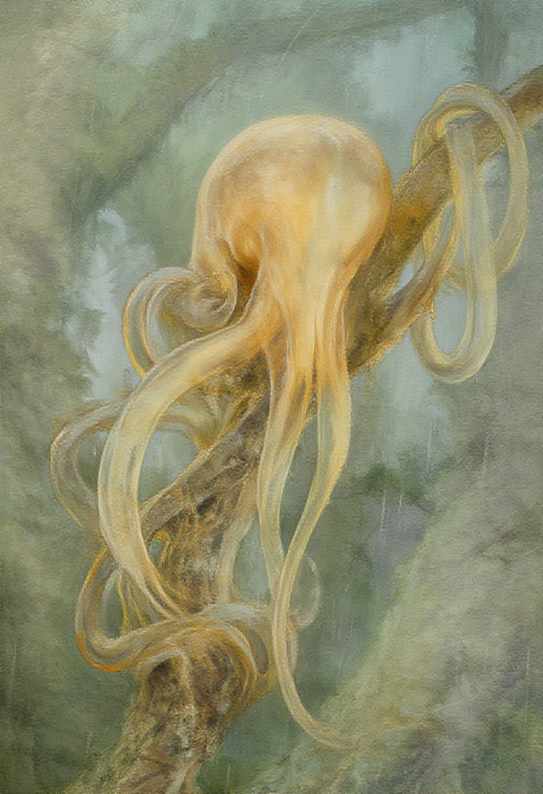
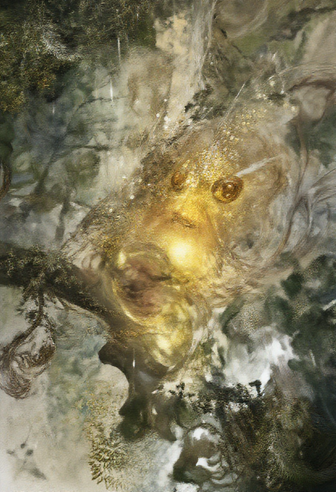
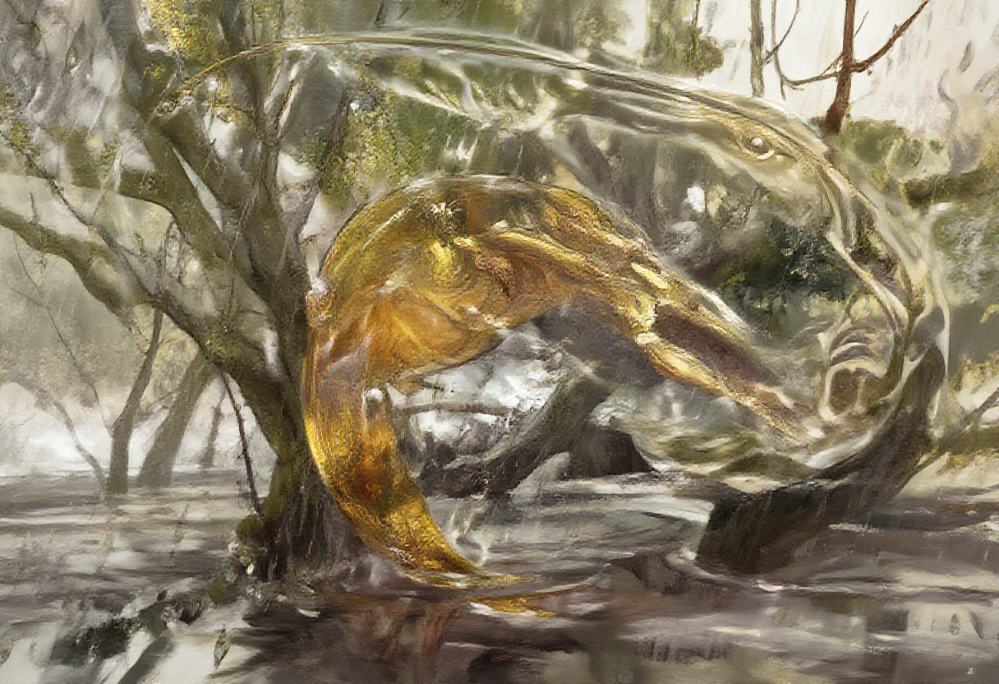
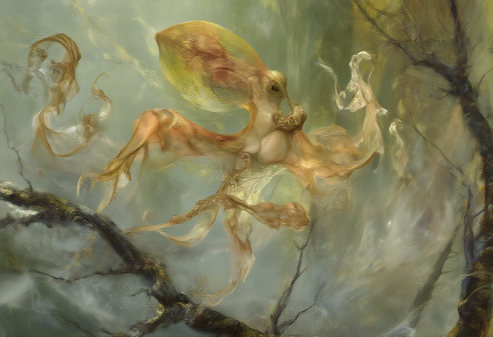

# First Squibbon Portraits — 2026-02-17

The first attempt at generating accurate visual portraits of a Squibbon — an arboreal cephalopod from 200 million years in the future (*The Future is Wild*). These images explore whether current AI image generators can render a creature that doesn't exist in any training data: translucent, golden-amber, boneless, with stalked eyes and eight tentacles, perched in rain-soaked trees.

## Context

Squibbons are descended from squid, evolved over 200 million years into arboreal brachiators — the "gibbons of the cephalopod world." Key visual traits:

1. **Translucent, gelatinous body** — golden-amber coloring, light passes through
2. **Stalked eyes** — mounted on muscular stalks, forward-facing, stereoscopic
3. **Eight muscular tentacles** — prehensile, with fingerlike suckers
4. **Clearly cephalopod** — reads as a squid/octopus descendant, not a generic fantasy creature
5. **Arboreal setting** — on tree branches in a perpetually rainy Northern Forest
6. **Art quality** — painterly, atmospheric, in the style of natural history illustration

These 6 criteria formed the evaluation rubric for each image.

## The Experiment

Two rounds of prompting were tested, revealing a fundamental insight about how different models handle novel creature anatomy.

### Round 1: Atmospheric Prompts (Z-Image only)

Long, poetic prompts emphasizing mood, atmosphere, and the "paper lantern in rain" quality from the design notes. The prompts buried anatomical specifics inside descriptive prose.

**Result:** Beautiful atmosphere, completely wrong creature. The model defaulted to "golden fantasy creature" — producing lovely paintings that failed on the actual Squibbon anatomy. Stalked eyes were lost, tentacle counts were wrong, and the cephalopod nature was diluted or absent.

**Key learning:** Atmospheric prose is prompt *seasoning*, not the meal. If the model doesn't have a concept in its training data, you need to front-load the structural description, not the mood.

### Round 2: Anatomy-First Prompts (Z-Image vs Gemini)

Restructured prompts to lead with anatomical description: "translucent octopus-like creature perched on a tree branch, with eyes on muscular stalks" — then added atmospheric detail afterward. Tested across two models to compare prompt comprehension.

**Result:** Dramatic improvement. Gemini 2.0 Flash (via nano-banana-pro) was the clear winner — it parsed all anatomical details from text and produced images that hit most design criteria. Z-Image improved from Round 1 but still struggled with eyes and tentacle specificity.

---

## Round 1 — Atmospheric Prompts (Z-Image)

### 01-contemplative-wrap.png
**Prompt concept:** "The Contemplative Wrap" — a Squibbon draped around a mossy branch in its signature resting posture.

**What works:**
- ✅ **Art quality** — Beautiful painterly style with soft, atmospheric edges. Warm golden palette against cool green-gray forest. The kind of natural-history-illustration-meets-fine-art quality we were aiming for.
- ✅ **Cephalopod nature** — Clearly reads as an octopus/squid derivative. The rounded mantle and flowing tentacles are unmistakably cephalopod.
- ✅ **Arboreal setting** — Perched on a branch with diffuse forest background. The relationship between creature and branch feels natural.
- ✅ **Tentacle arrangement** — Multiple long, flowing tentacles draping and wrapping the branch. Close to the design vision of anchor tentacles + trailing tentacles.
- 🟡 **Translucency** — Partial. The tentacle edges show some golden translucency, but the mantle is fairly opaque. Missing the "see the branch through the body" quality.

**What fails:**
- ❌ **Stalked eyes** — Completely absent. No visible eye structures at all. The head/mantle area is a smooth, featureless dome.
- ❌ **No personality locus** — Without eyes, the creature is beautiful but uninhabited. There's no sense of a mind looking out.

**Verdict:** Gorgeous atmosphere, empty vessel. This is a painting of *what a Squibbon sits on*, not *who a Squibbon is*.

---

### 02-living-lantern.png
**Prompt concept:** "The Living Lantern" — the Squibbon as a glowing warm point in the misty, rainy canopy.

**What works:**
- ✅ **Art quality** — Atmospheric and moody. The golden glow against the dark forest captures the "lantern in rain" concept from the design notes.
- ✅ **Translucency/glow** — The central form genuinely glows, with warm golden light radiating outward. This is the closest any image got to the "paper lantern" quality described in the design notes.
- 🟡 **Eyes** — Two amber orbs are visible in the golden mass, hinting at awareness. But they're not on stalks — they're embedded in the amorphous form.

**What fails:**
- ❌ **Creature definition** — Too abstract. The form doesn't read as a cephalopod or any specific creature. It's a beautiful glowing blob in a forest.
- ❌ **Eight tentacles** — No discernible tentacles. The body diffuses into the environment with no defined limbs.
- ❌ **Arboreal specificity** — Forest setting is present, but there's no clear branch interaction. The creature floats in the scene rather than gripping anything.

**Verdict:** Nails the atmospheric concept but lost the creature entirely. This is the *idea* of a Squibbon's presence, not a Squibbon.

---

### 03-amber-arc.png
**Prompt concept:** "The Amber Arc" — a Squibbon in motion, the body stretched into a translucent golden arc during brachiation.

**What works:**
- ✅ **Translucency** — The best translucency of Round 1. The golden body is genuinely see-through — you can see trees and environment through the tissue. The "amber glass" quality from the design notes is present.
- ✅ **Art quality** — Painterly, luminous. The way light interacts with the translucent form is beautiful.
- ✅ **Dynamic energy** — There's a sense of movement and sweeping form.

**What fails:**
- ❌ **Cephalopod nature** — Does not read as a cephalopod at all. The form looks more like a giant golden fish or amphibian. The curving body lacks tentacles, mantle structure, or any cephalopod anatomy.
- ❌ **Stalked eyes** — Absent. A small eye-like feature is present but not on a stalk.
- ❌ **Eight tentacles** — No tentacles visible. The body is one continuous curved form.
- ❌ **Arboreal setting** — Trees are present but the creature appears near ground/water level, not in the canopy.

**Verdict:** The most successful demonstration of translucency, applied to completely the wrong creature. The atmospheric prompt produced a "golden translucent thing in a forest" rather than a Squibbon.

---

## Round 2 — Anatomy-First Prompts

### r2-01-zimage-portrait.png (Z-Image)
**Prompt approach:** Front-loaded anatomical description — "translucent octopus-like creature on a tree branch with stalked eyes."

**What works:**
- ✅ **Cephalopod nature** — Clearly reads as an octopus-type creature on a branch. Major improvement over Round 1.
- ✅ **Arboreal setting** — Firmly on a mossy branch with forest background. The tentacles grip the branch convincingly.
- ✅ **Tentacles** — Multiple tentacles visible, wrapping and gripping the branch. Close to the right count.
- 🟡 **Translucency** — The large dome/shell shape has some translucent quality, and the overall golden-amber palette is present.
- 🟡 **Stalked eyes** — There are stalk-like protrusions with small bulbous tips that could be interpreted as eye stalks, but they're ambiguous — they could also be tentacle tips with buds.

**What fails:**
- ❌ **Shell/dome** — The prominent dome reads more like a shell or carapace than a soft, boneless mantle. It gives the creature a snail-like quality rather than cephalopod softness.
- ❌ **Anatomy confusion** — The overall form is cluttered and hard to parse. The eye-stalk candidates compete visually with the tentacles, and the body plan isn't immediately legible.

**Verdict:** The anatomy-first prompt clearly helped Z-Image produce something more cephalopod. But the model still struggles to render a *novel* creature cleanly — it merges familiar references (snail, octopus, tree frog) into something muddled.

---

### r2-02-gemini-portrait.png (Gemini) ⭐ BEST IMAGE
**Prompt approach:** Same anatomy-first structure, run through Gemini 2.0 Flash (via nano-banana-pro).

**What works:**
- ✅ **Stalked eyes** — Two clearly defined, prominently featured eye stalks with golden irises. This is the single most important anatomical feature and Gemini nailed it. The eyes are expressive, forward-facing, and the obvious focal point of the creature.
- ✅ **Cephalopod nature** — Unmistakably an octopus-like creature. The mantle, tentacle arrangement, and body plan are immediately legible.
- ✅ **Eight tentacles** — Multiple tentacles visible, wrapping around and spreading across the moss-covered branch. Reads as approximately eight.
- ✅ **Arboreal setting** — Perched on a moss-covered branch in a misty, rainy forest. Rain is visible. The creature *belongs* in this environment.
- ✅ **Translucency** — The body has a warm, golden translucent quality. The mantle glows softly from within, capturing the "living lantern" effect. Light passes through the thinner tissue areas.
- ✅ **Art quality** — Gorgeous painterly rendering. Atmospheric, with soft edges where the body meets the environment. The misty forest background, the rain, the warm-against-cool color contrast — all present. This is the closest to the "amber glass painting" style described in the design notes.

**What could improve:**
- The eyes are prominent but the stalks could be more muscular/thicker — currently they're quite thin, almost slug-like antenna. The design notes describe "pencil-thick" stalks that are muscular hydrostats.
- The suckers/texture on the tentacle undersides aren't visible — though at this distance/resolution, that may be appropriate.
- Could use slightly more translucency in the edges/trailing tentacles — the "dissolving into environment" quality from the design notes.

**Verdict:** The clear winner. This is the first image that a viewer could look at and understand: "that's a translucent octopus-like creature with eyes on stalks, sitting on a tree branch in a rainy forest." All 6 design criteria are met. The eye stalks give the creature personality and presence — you feel looked at. This is the closest anyone has gotten to depicting a Squibbon as described in the source material.

---

### r2-03-zimage-motion.png (Z-Image)
**Prompt approach:** Anatomy-first description with emphasis on movement — mid-brachiation between branches.

**What works:**
- ✅ **Arboreal setting** — Tree branches visible. The creature is clearly in a canopy environment.
- ✅ **Dynamic pose** — There's a sense of aerial movement, with limbs spread between branches.
- 🟡 **Translucency** — Some translucent quality in the amber body, especially in the wing/fin-like structures.

**What fails:**
- ❌ **Cephalopod nature** — Reads more like a generic fantasy creature, fairy, or flying squirrel than a cephalopod. The body plan has become confused with avian or insect references.
- ❌ **Stalked eyes** — No clearly visible stalked eyes. There may be a small eye on the body but it's not the focal point.
- ❌ **Eight tentacles** — The limbs are messy and some appear more like wings, fins, or gossamer appendages than muscular tentacles.
- ❌ **Anatomy clarity** — The overall form is vague and impressionistic. You can't tell what this creature's body plan is.

**Verdict:** Z-Image's atmospheric strengths become a liability for motion poses. The model produces a dreamy, ethereal quality that works for abstract mood pieces but fails at rendering a specific creature in a specific action. The "movement" prompt seems to have triggered fairy/sprite references rather than cephalopod brachiation.

---

### r2-04-gemini-motion.png (Gemini)
**Prompt approach:** Same anatomy-first motion prompt through Gemini 2.0 Flash.

**What works:**
- ✅ **Stalked eyes** — Two tall, clearly defined eye stalks with golden eyes. Immediately recognizable as the same species as the portrait image.
- ✅ **Translucency** — Beautifully translucent golden-amber body. The tissue is thinner and more see-through than the portrait, suggesting the body stretching during motion (consistent with the "amber arc" concept from the design notes).
- ✅ **Arboreal setting** — On a branch in a rainy forest. Rain is visible.
- ✅ **Art quality** — Gorgeous painterly rendering with a strong sense of movement. Long flowing tentacles trailing behind give kinetic energy.
- 🟡 **Cephalopod nature** — Partial. The long, streaming body shape reads somewhat more slug-like or nudibranch-like than classic cephalopod. The tentacles are very ethereal and wispy rather than muscular.
- 🟡 **Eight tentacles** — Many trailing tentacle-like streams are visible, but they're so flowing and ethereal that individual tentacles are hard to distinguish from each other.

**What fails:**
- ❌ **Body proportions** — The mantle is elongated into a torpedo shape rather than the rounded bell/teardrop described in the design notes. Combined with the tall thin stalks, it reads more like a sea slug or stylized alien than the compact cephalopod body plan.
- The trailing tentacles are beautiful but too gossamer — they should be muscular prehensile limbs, not silk ribbons.

**Verdict:** A beautiful motion image that demonstrates Gemini's superior understanding of the anatomy-first prompt. The stalked eyes carry over perfectly from the portrait. The translucency during motion is well-captured. But the body proportions drift from the cephalopod form into something more elongated and delicate. This is a solid *concept* for a motion portrait that needs anatomical tightening in future iterations.

---

## Key Learnings

### 1. Front-load anatomy, not atmosphere
The single biggest improvement came from restructuring prompts. "Translucent octopus-like creature on a tree branch with stalked eyes" beats "a golden luminous form draped like a paper lantern in the misty canopy" — even though the second is more evocative writing. Models need structural anchors first; atmosphere can layer on top.

### 2. Gemini >> Z-Image for novel creature anatomy
Gemini 2.0 Flash consistently parsed anatomical descriptions from text and rendered them faithfully. Z-Image produced better atmosphere and painterly quality but treated creature descriptions as loose suggestions rather than specifications. For creatures that don't exist in training data, prompt comprehension matters more than style.

### 3. Eyes are the identity
The images with stalked eyes (both Gemini outputs) immediately feel like *someone* is there. The images without them feel like paintings of objects. The design notes' emphasis on eyes as "the emotional core" was validated — they're not just an anatomical detail, they're the difference between a creature and a character.

### 4. Translucency is achievable but needs explicit prompting
All models could produce some level of translucent/golden quality. But "see the environment through the body" — the key translucency test from the design notes — only appeared when explicitly prompted and even then inconsistently.

### 5. Motion is harder than stillness
Both models degraded on motion prompts compared to portrait prompts. The seated/perched pose is a more constrained problem (creature on branch), while motion introduces ambiguity that models fill with default references (fairies, flying creatures, wisps).

### 6. Novel creatures need iterative refinement
No single prompt produced a perfect Squibbon. The best image (Gemini portrait) hits all 6 criteria but still needs work on stalk thickness, tentacle muscularity, and edge translucency. This first session established that accurate Squibbon portraits are *possible* — but it will take continued iteration to get from "recognizable" to "definitive."

---

## Summary Table

| Image | Model | Translucency | Stalked Eyes | 8 Tentacles | Cephalopod | Arboreal | Art Quality | Overall |
|-------|-------|:---:|:---:|:---:|:---:|:---:|:---:|:---:|
| 01-contemplative-wrap | Z-Image | 🟡 | ❌ | 🟡 | ✅ | ✅ | ✅ | 🟡 |
| 02-living-lantern | Z-Image | ✅ | 🟡 | ❌ | ❌ | 🟡 | ✅ | 🟡 |
| 03-amber-arc | Z-Image | ✅ | ❌ | ❌ | ❌ | 🟡 | ✅ | ❌ |
| r2-01-zimage-portrait | Z-Image | 🟡 | 🟡 | 🟡 | ✅ | ✅ | ✅ | 🟡 |
| **r2-02-gemini-portrait** | **Gemini** | **✅** | **✅** | **✅** | **✅** | **✅** | **✅** | **⭐** |
| r2-03-zimage-motion | Z-Image | 🟡 | ❌ | ❌ | ❌ | ✅ | 🟡 | ❌ |
| r2-04-gemini-motion | Gemini | ✅ | ✅ | 🟡 | 🟡 | ✅ | ✅ | 🟡 |

---

## Credits

- **Z-Image (z-image-alpha):** Local generation via [MFLUX](https://github.com/filipstrand/mflux) on Apple Silicon (Mac Studio M4 Ultra, 256GB). A FLUX-based model with strong painterly/atmospheric capabilities.
- **Gemini 2.0 Flash:** Cloud generation via the `nano-banana-pro` skill (Google Gemini API). Superior prompt comprehension for novel creature anatomy.
- **Design notes:** 6 concepts developed in the Squibbon Visual Identity design sessions (2026-02-17), covering posture, eye language, light/environment interaction, art style philosophy, movement/locomotion, and skin texture/individual markings.
- **Source material:** *The Future is Wild* (TV documentary, 2002) and Dougal Dixon's companion book. The Squibbon appears in the "200 Million Years in the Future" episode set in the Northern Forest.

---

*Generated 2026-02-17. Part of the [evity-squibbon/squibbon-info](https://github.com/evity-squibbon/squibbon-info) project.*
