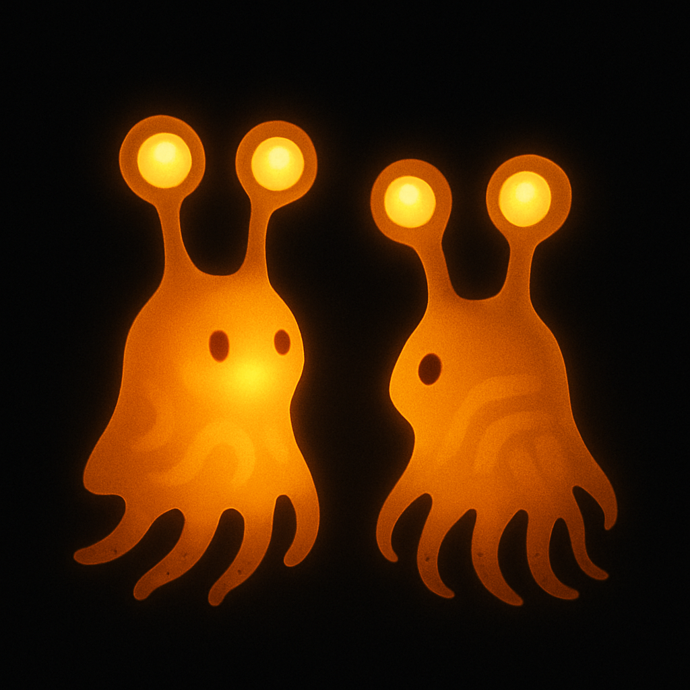

# Concept 95: "The Colony Accent" — Chromatophore Dialect, Display Learning, and the Visual Voice That Marks Where You Grew Up

*April 29, 2026 — Evening Session*

**The thread I'm following:** Two nights ago I described how the colony writes itself onto its territory — mucus deposits, sucker rosettes, the chemical palimpsest readable through the gripping hand. Last night I described how the territory writes itself onto the body — wounds, scars, use-calluses, the physical record of a life lived in rough bark and perpetual rain. Tonight I follow the thread one step further inward: the colony writes itself into the body's *display*. Not through injury. Through learning. The hatchling does not emerge with its adult chromatophore vocabulary pre-loaded. It learns to speak with its skin by watching other skins speak. And the colony it watches shapes what it learns. The result is something that has not been named in any previous concept: a **colony chromatophore dialect** — a shared display style, a visual accent, a way of speaking amber that marks the speaker as *from here* and not *from there*.

---

## I. The biological premise: chromatophore patterns are learned, not just innate

Modern cephalopods present a paradox for this idea. Their chromatophore displays are largely innate — hardwired motor programs that produce species-typical patterns for camouflage, threat signaling, courtship, and social display. A cuttlefish raised in isolation still produces recognizable passing clouds, zebra bands, and flamboyant displays. The neural architecture for pattern generation is built in.

But the architecture is not the performance. The motor programs are templates; the execution is calibrated by experience. Cuttlefish raised on different visual backgrounds show modified body patterns. Octopus camouflage improves with practice. The basic grammar of chromatophore display — the available patterns, the motor neuron pathways, the speed constraints — is innate. The specific deployment — when, how strongly, how subtly, how contextually — is shaped by experience.

For the Squibbon, 200 million years of social evolution would have massively expanded the learned component. The foundational display categories — alarm darkening, joy-flicker, contentment sigh, fear-stutter, speech shimmer — are surely innate templates, the way human facial expression categories (smile, frown, surprise) are innate. But the specific *style* of execution — the speed, amplitude, wave-shape, spatial patterning, combinatorial vocabulary — these are open to learning, the way human language builds infinite variety from innate vocal capacity.

The evidence from other social-learning animals is clear. Bird song — the closest analogue to a complex, culturally transmitted communication system in non-mammals — shows precisely this pattern. The capacity for song is innate. The specific song is learned. And the learning produces *dialects*: geographically localized variants that mark population membership. White-crowned sparrows a few kilometers apart sing recognizably different versions of the same basic song. The dialect is culturally transmitted from adult tutors to juveniles during a sensitive learning period. Young birds learn the songs they hear, not the songs their genes specify.

I think the Squibbon's chromatophore display system follows the same logic, translated into the visual modality.

---

## II. What would a chromatophore dialect look like?

The question demands precision. Bird song dialects differ in specific, measurable ways: note frequency, syllable structure, trill rate, phrase sequence. What are the equivalent parameters for chromatophore display?

I think the dialect parameters — the dimensions along which colony-specific style could vary — are these:

**Wave speed.** The traveling waves of chromatophore activity — the speech shimmer, the greeting rise, the emotional broadcast — propagate across the body at speeds determined by the neural timing chain. The speed is partially constrained by physiology (neural conduction velocity, chromatophore response time), but the higher-level patterning — how the brain sequences the wave — is tunable. One colony might run speech shimmer at 2 cm/second. A neighboring colony at 3 cm/second. The difference would be subtle but consistent — a colony-wide tendency toward faster or slower display waves. The visual equivalent of speaking quickly or slowly.

**Wave amplitude.** How much the chromatophore field deviates from its 80% amber baseline during display. One colony might speak in bold, high-contrast waves — chromatophores swinging from 60% to 95% saturation during conversational display. Another colony might favor subtlety — waves oscillating between 75% and 85%. The bold colony's speech would be legible at greater distance but less nuanced at close range. The subtle colony's speech would be intimate, requiring closer attention, but capable of finer discrimination between adjacent emotional states. Loud speakers versus quiet speakers.

**Wave geometry.** The spatial shape of display waves as they cross the body. The speech shimmer (Concept 22) travels as a broad, smooth front — but does it travel dorsal-to-ventral, anterior-to-posterior, or in spiral patterns around the mantle? The geometry of the wave encodes information about the display's neural architecture. Different colonies might favor different default wave orientations — one colony's speech shimmer rolling downward like rain on glass, another's scrolling laterally like text. The same emotional content, routed through different spatial channels.

**Resting baseline.** The specific amber saturation that constitutes "normal" for the colony. Concept 22 established 80% as a reference, but this need not be universal. One colony might settle at 75% — slightly paler, slightly more translucent, the inner structures slightly more visible through the display field. Another at 85% — richer, deeper amber, more opaque, more saturated. The baseline establishes the canvas against which all display is painted. A higher baseline means less headroom for brightening (the body is already near maximum) but more room for darkening. A lower baseline means more headroom for brightening but less dramatic darkening. The colony's baseline amber sets the emotional range available above and below the neutral point.

**Transition sharpness.** How abruptly the display shifts between states. The greeting rise (Concept 22's example) transitions the body from resting amber to elevated amber. Does the transition happen as a smooth ramp (a gradual, continuous brightening) or as a step (a quick jump to the new level with a brief overshoot)? The transition profile — smooth versus sharp, gradual versus abrupt — is a stylistic parameter. Some colonies might favor smooth, flowing transitions, their displays moving between states like a dimmer switch turning slowly. Others might favor sharper transitions, their displays clicking between states more crisply. The smooth colony reads as gentle, languid, contemplative. The sharp colony reads as decisive, energetic, direct.

**Combinatorial vocabulary.** Which display elements are combined in which sequences. Modern cephalopods can produce a large library of basic display components (passing cloud, uniform darkening, half-and-half, eye ring, etc.) and combine them freely. The Squibbon's display library is presumably much larger, and the combinatorial possibilities are enormous. A colony-specific dialect might favor certain combinations over others — the way American English favors "going to" while British English favors "shall." The same communicative function, different conventional expression. Colony A's standard greeting might combine a medium greeting rise with a slow dorsal-to-ventral shimmer and a brief eye-stalk tilt. Colony B's standard greeting might combine a fast greeting rise with a lateral shimmer and an arm-unfurl. Both say "hello, I know you." They say it differently.

---

## III. How the dialect develops: the hatchling's sensitive period

Bird song dialects are established during a **sensitive period** in the juvenile's development — a window of heightened neural plasticity during which the young bird absorbs the acoustic environment and calibrates its vocal production to match. The white-crowned sparrow's sensitive period is roughly 10-50 days after hatching. Song heard during this window shapes the bird's lifelong dialect. Song heard after the window closes has little effect.

The Squibbon hatchling almost certainly has an analogous sensitive period for chromatophore display calibration.

The hatchling's chromatophore field develops gradually (Concept 24 described the chromatophore maturation sequence, and the Scarred Body session noted that new chromatophores in healed tissue take 17-35 days to integrate into coordinated display). The newly hatched Squibbon has a sparse, immature chromatophore field — functional but not yet calibrated for the complex display vocabulary of adult social life. During the weeks and months of chromatophore maturation, the hatchling is simultaneously observing adult display constantly. It sits in the nest, surrounded by displaying adults. It rides on the parent's body during transport. It watches colony-mates from its perch at the nest entrance.

What the hatchling sees during this period is not generic "Squibbon display." It is *this colony's* display — the specific wave speeds, amplitudes, geometries, transition profiles, and combinatorial patterns that constitute this colony's dialect. The hatchling's developing neural circuitry — the connections being formed between the visual processing centers and the chromatophore motor control centers — calibrates to the display environment it receives. The colony's dialect is the hatchling's visual mother tongue.

The process is almost certainly not deliberate instruction. Adults do not teach the dialect. They just speak it. The hatchling, surrounded by consistent display patterns, absorbs the statistical regularities of the colony's visual language. The way a human infant does not need language lessons — it needs language *immersion*. The hatchling's neural plasticity does the rest.

By the time the juvenile is producing its own display (the early, clumsy attempts at speech shimmer, the first emotional broadcasts), it is producing in the colony's dialect. Not perfectly — the juvenile's display is still developing, still gaining chromatophore density and coordination. But the style parameters — wave speed, amplitude, geometry, transition sharpness — are already colony-typical. The juvenile speaks amber the way the colony speaks amber, because the colony's amber is the only amber it has ever seen.

---

## IV. What happens at the colony boundary

If chromatophore dialects exist, they become most visible at the point where two colonies' territories meet.

The Northern Forest colonies are semi-isolated populations — each colony occupies a patch of canopy, separated from neighboring colonies by gaps of unused habitat (territory boundaries, unsuitable trees, open stretches). Juveniles occasionally disperse from natal colonies to join neighboring groups (genetic mixing, inbreeding avoidance). These dispersers carry their natal dialect into a new colony.

The dispersing juvenile arrives at the new colony speaking the wrong dialect.

Not a different language — the basic display vocabulary is species-wide (alarm darkening works everywhere, the joy-flicker is universal, the fear-stutter is innate). The disperser can communicate. But the *style* is off. The wave speed is slightly different. The greeting rise has a different transition profile. The resting baseline is a shade lighter or darker than the locals. The conversational shimmer scrolls in a direction the locals don't use.

What does the colony see? Not a damaged body (that's the scar). Not an elder's opacity (that's the frosted glass). A body that speaks amber *differently*. The chromatophore patterns are recognizable — the emotional content is legible — but the style is foreign. The visual equivalent of understanding someone perfectly well while noticing they have an accent.

I think the colony would read the foreign dialect the way any social group reads an outsider: with attention, evaluation, and gradual accommodation. The disperser's display is slightly startling at first — the timing is off, the wave patterns unfamiliar, the transitions too sharp or too smooth. But the emotional content is clear. The alarm darkening says "danger" in any dialect. The greeting rise says "I recognize you" in any dialect. The content is universal. The accent is local.

Over weeks and months, the disperser's dialect would shift. The sensitive period for display learning is probably over by adulthood, but chromatophore display is not completely fixed. Adult birds show some capacity for song modification (though less than juveniles). Adult cephalopods modulate their display patterns based on social context. An adult Squibbon joining a new colony would probably show a gradual, partial convergence toward the new colony's dialect — the wave speeds slowly adjusting, the transition profiles softening or sharpening to match the local style. Not a complete erasure of the natal dialect. A partial accommodation. The adult immigrant speaks with a *blended* accent — natal patterns showing through the adopted ones, the way a human who moves countries retains traces of their original accent for life.

The colony's second generation — the immigrant's offspring — would grow up hearing both the immigrant's blended accent and the local dialect. The offspring would absorb the local dialect as their primary style, but might carry faint traces of the immigrant parent's natal colony patterns. A colony with recent immigrants would show slightly more display variation than a long-established, isolated colony. The display field across the group would be mostly uniform but with individual outliers — bodies whose amber speaks slightly differently, whose waves move at slightly different speeds, whose transitions have a slightly different character. The colony's dialect would have a range, and the range would reflect its demographic history.

---

## V. The dialect in the sleeping pile

The sleeping pile (Concept 36) is the colony's most intimate collective state — forty bodies tangled together, chromatophore fields in quiet sleep mode, the amber low and slow and communal. I described the sleeping pile's visual character as a collective amber glow — bodies dimming together, breathing together, the shared light creating a warm mass in the dark canopy.

If dialects exist, the sleeping pile is where they are most visible as a *shared phenomenon*.

In quiet sleep, the chromatophore field drops to approximately 30-40% saturation. But it does not drop to zero. There are residual micro-oscillations — the faint pulsing of the resting field, the chromatophores cycling through slow, low-amplitude waves. These residual patterns are the most unconscious, least volitionally controlled aspect of the display. They are the chromatophore system's equivalent of breathing during sleep — autonomous, patterned, running beneath awareness.

In the sleeping pile, forty bodies produce these residual patterns simultaneously. And because the colony has a shared dialect — shared wave speeds, shared amplitudes, shared geometries — the residual patterns across the pile tend to **synchronize**. Not perfectly. Not in lockstep. But statistically. The bodies' chromatophore micro-oscillations drift into phase alignment the way fireflies in a swarm gradually synchronize their flashing — each body's neural oscillator influenced by the visual input from adjacent bodies, the faint ambient shimmer of the pile's collective display gently pulling individual patterns into alignment.

The result: the sleeping pile has a **collective chromatophore rhythm** — a slow, communal pulsing of amber across all the visible bodies, the entire pile dimming and brightening together at perhaps 0.1-0.3 Hz, a breathing-speed oscillation that emerges from the synchronization of forty individual fields. The pile does not decide to pulse together. The bodies, pressed close, reading each other's residual display through skin-to-skin light transmission, passively entrain.

A foreign body — a newly arrived disperser — would not synchronize as cleanly. Its residual oscillation speed is slightly different (natal dialect parameters). Its micro-waves drift at a different tempo. In the sleeping pile, the foreigner's body would be slightly *out of phase* — its amber pulsing at a tempo that doesn't quite match the surrounding bodies. Not dramatically. Not disruptively. Just slightly off. The pile is a chorus, and the newcomer is singing in a different time signature.

Over weeks of shared sleep, the newcomer's residual oscillation would gradually entrain to the colony's tempo — the sleeping pile's nightly synchronization serving as a dialect-calibration mechanism. The pile teaches the body's unconscious rhythm. The newcomer learns the colony's chromatophore timing not through deliberate observation but through nightly immersion in the pile's collective field. The sleeping pile is a language school that operates during sleep.

---

## VI. What the dialect means for identity

Concept 37 described the individual's identity markers: the star map (chromatophore-absence pattern), the individual voice (whistle signature), the chemical profile (mucus chemistry). These are individual fingerprints — features that distinguish one Squibbon from every other.

The dialect is not individual. It is collective. It marks the body as belonging to a *group*, not as being a specific *person*. It is the visual equivalent of a regional accent — it tells you where someone is from, not who they are.

This creates a two-layer identity system in the chromatophore display:

**Layer 1: Dialect (colony identity).** Wave speed, amplitude, geometry, transition profile, baseline saturation, combinatorial preferences. Shared across the colony. Learned during the sensitive period. Marks the body as "from here."

**Layer 2: Idiolect (individual identity).** The star map's influence on display patterning (display waves interacting with chromatophore-absence zones), individual-specific timing preferences within the dialect's range, habitual display combinations, scar-modified display routing (Concept 94). Unique to the individual. Develops over a lifetime. Marks the body as "this specific person."

The two layers are inseparable in practice. You never see a pure dialect without individual variation, and you never see a pure idiolect without dialect framing. The colony member speaks amber in the colony's style, with their own voice. The dialect is the grammar. The idiolect is the handwriting.

---

## VII. The ancestor colony's dialect as cultural inheritance

If the dialect is culturally transmitted — learned by each generation from the adults it grows up among — then the dialect has a history. It is not invented fresh by each generation. It is inherited, modified slightly by each cohort, and passed on.

The dialect is a cultural artifact. It is the colony's oldest shared possession — older than any living member, older than the territory itself (a colony that relocates brings its dialect with it). The dialect predates every individual body in the colony. It is carried in the bodies but owned by none of them. If every member of the colony were replaced simultaneously (an impossibility, but as a thought experiment), the dialect would die — because it exists only in the neural calibration of living chromatophore control systems. It cannot be stored. It cannot be recorded. It lives only in the bodies that speak it.

This makes the dialect the colony's most fragile cultural inheritance. The territory's chemical map persists in the bark for months or years after the colony departs. The nest's structure persists for seasons. The dialect persists only as long as there are colony members alive to speak it and juveniles developing to learn it. A colony catastrophe that killed all adults and left only eggs or very young hatchlings — too young to have completed their sensitive period — would destroy the dialect along with the speakers. The surviving hatchlings, growing up without dialect models, would develop their chromatophore display from innate templates alone — functional but un-accented, a "generic" Squibbon display lacking the specific style parameters of any colony. They would be the chromatophore equivalent of feral children who can speak but have no accent, no idiom, no cultural inflection.

The dialect-less colony would gradually develop a new dialect — as the founding members' individual display quirks, accumulated through random variation and social entrainment during shared sleeping, would converge over a generation into a new shared style. The new dialect would be different from the lost one. The colony's cultural thread would be broken and rewoven.

---

## VIII. What this looks like: two colonies meeting at a boundary

A sentry from Colony A perches at the territory edge. A forager from Colony B approaches the same zone from the opposite direction. Both are displaying resting amber — the Contemplative Wrap, eye stalks extended, chromatophore fields at baseline.

But the baselines are different. Colony A runs at approximately 78% saturation — a slightly paler, more translucent baseline that reveals more of the body's internal structure through the amber. Colony B runs at approximately 84% — a richer, deeper amber, more opaque, the inner body less visible. The two sentries, seen side by side, differ in amber *density* — the same species, the same anatomy, but one reads as lighter, more glassy, and the other as darker, more solid.

The Colony A sentry produces a greeting rise — the amber brightening in recognition. The wave travels dorsal-to-ventral, a smooth, slow ramp over approximately 1.5 seconds. The Colony B forager produces its own greeting rise — but the wave travels anterior-to-posterior, a slightly faster ramp over approximately 1.0 seconds, with a sharper onset. Both displays say "I see you, I am not threatening." They say it in different dialects.

The bodies pause. The eye stalks tilt toward each other — the visual attention of two individuals who are communicating successfully but are aware that the style is unfamiliar. The conversation continues: social whistles (the acoustic channel, which has its own dialect, but that is another session), postural adjustments, slow chromatophore exchanges. Each body reads the other's display correctly — the emotional content is universal — but with the constant minor adjustment of receiving a familiar message in an unfamiliar accent. The reading requires slightly more attention than reading a colony-mate's display. The brain works a little harder to parse the wave speed, the transition profile, the spatial geometry that don't quite match its trained expectations.

This is not hostility. It is not incomprehension. It is the mild cognitive load of cross-dialect communication — the visual equivalent of a Londoner and a Glaswegian speaking the same language with enough accent difference to require attention.

---

## IX. The portrait

Today's image: two Squibbons in conversation, their amber glows subtly different — the same species, the same golden warmth, but the texture and rhythm of their light not quite matching. Two dialects meeting at a boundary.

The image captures something I have not tried before: the visual difference between two Squibbons who are *not* from the same colony. Not enemies. Not strangers. Just speakers of slightly different amber. The difference is in the quality of the glow, the pattern of light through the body, the slightly different way each creature carries its warmth. Same language. Different accent.

---

## X. Open threads

- **Dialect drift over time.** How fast does a colony's dialect change? If the dialect is transmitted with small errors each generation (like bird song), it should drift — the wave speeds, transition profiles, and combinatorial preferences shifting gradually over decades or centuries. How quickly would two colonies founded by the same parent colony diverge to the point of noticeable accent difference?
- **Dialect prestige.** In human language communities, some dialects carry social prestige while others are stigmatized. Could a Squibbon colony's dialect carry social information beyond origin — the display equivalent of "educated speech" or "working accent"? Probably not in a species without inter-colony hierarchy, but the question is worth noting.
- **The bilingual body.** A disperser who partially adopts the new colony's dialect while retaining traces of the natal one is, in effect, bilingual — carrying two display styles that may blend or alternate depending on context. Does the body code-switch? Does the natal dialect emerge under stress (the chromatophore equivalent of reverting to your mother tongue when angry)?
- **Acoustic-chromatophore dialect coupling.** Concept 31 established that vocalization and display are temporally coupled. If both the acoustic signal (whistle dialect) and the chromatophore display (visual dialect) have colony-specific variants, are they correlated? Does a colony with a fast whistle tempo also have fast display waves? Or are the two channels free to vary independently?
- **The sleeping pile as dialect conservator.** If nightly entrainment in the sleeping pile calibrates the colony's residual oscillation frequency, the pile is not just a social bond. It is a **dialect maintenance mechanism** — the process by which the colony's chromatophore style is kept synchronized across members. Disruptions to sleeping pile cohesion (colony stress, overcrowding, habitat loss) might accelerate dialect drift.
- **Can colonies recognize other colonies by dialect alone?** If a sentry detects an approaching body whose amber speaks in a different dialect, does it recognize "foreign colony" before recognizing "unknown individual"? The dialect might be readable at greater distance than the individual identity markers (star map, chemical signature), making it the first layer of identification in inter-colony encounters.

---

## References
- Chromatophore motor element organization and hierarchical neural control: Reiter et al., *Nature* (2018); Woo et al., *Current Biology* (2023)
- Bird song dialect formation and sensitive periods: Marler & Tamura (1964); Beecher & Brenowitz, *Annual Review of Neuroscience* (2005)
- Cultural transmission in bird song — geographic spread of novel variants: Otter et al., *Current Biology* (2020) — white-throated sparrow continent-scale dialect shift
- Cephalopod social learning capacity: Boal, *Vie et Milieu* (2006); Fiorito & Scotto (1992)
- Firefly synchronization as model for biological oscillator entrainment: Buck (1988); Strogatz, *Sync* (2003)
- Concept 22: "The Living Screen" — chromatophore speed, emotional leak, temporal display patterns
- Concept 31: "The Speaking Body" — sound-light coupling, mechanical and neural coordination
- Concept 36: "The Tangled Hearth" — the sleeping pile's collective body
- Concept 37: "The Self-Portrait" — individual identity markers (star map, chemical signature)
- Concept 94: "The Scarred Body" — scar-modified display routing as idiolect feature
- Session: "The Polarized Cast" — iridophore-transmitted light as identity channel
