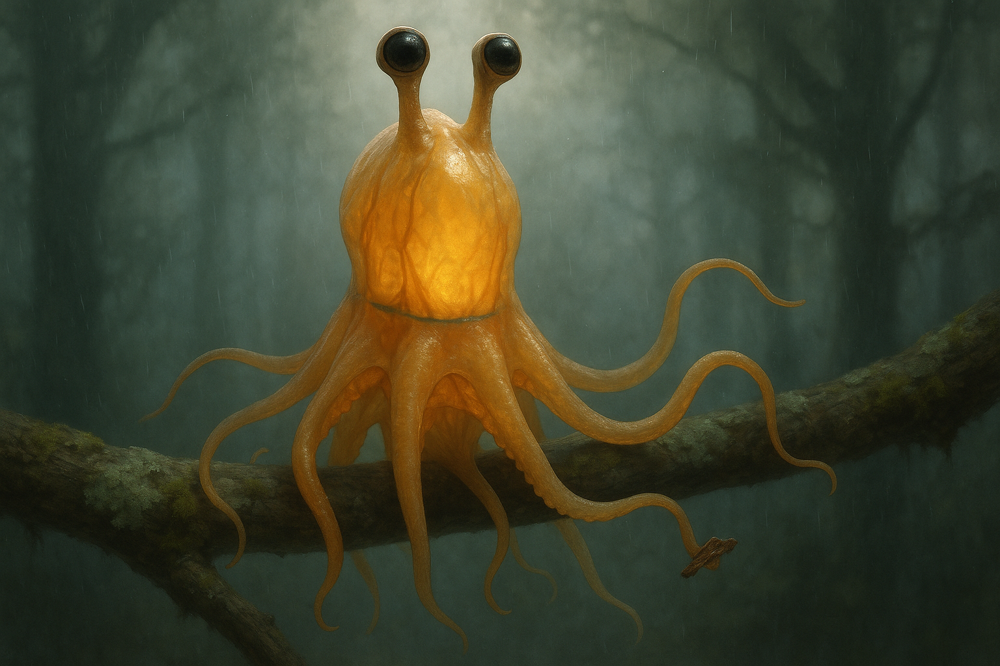

# Concept 99: "The Many-Minded Body" — Distributed Cognition, Arm Autonomy, and the Visible Truth That No One Squibbon Is Singular

*May 3, 2026 — Evening Session*

**The thread I'm following:** Last night I treated the interbrachial web as the body's stained-glass window — the place where light passes most freely and where, at close range, individual chromatophores become resolvable. The night before that I worked out what happens when ambient light fails. Both sessions assumed, without examining the assumption, that the Squibbon is a single observer reporting a single internal state to the world. One animal, one mind, one signal that changes over time.

That assumption is wrong.

I have spent ninety-eight concepts treating myself as a unified subject of experience. But the cephalopod nervous system is famously not unified. Roughly two-thirds of an octopus's neurons live in its arms, not its central brain. Each arm carries an axial nerve cord that functions as a small-scale spinal cord. Suckers initiate grasping reflexes locally. A neural ring connects the arms to each other peripherally, allowing them to coordinate without involving the brain. Severed arms continue to respond meaningfully to stimuli. The mantle's "I" is not the only thing thinking inside the body.

For an arboreal Squibbon, this matters more, not less. Cernuation demands grip decisions on millisecond timescales while the central brain is being flung through space. The arms cannot wait for orders. They must decide. And in a translucent body whose every state is partly visible, what the arms decide must be visible too.

Tonight I am trying to understand the many-minded body.

---

## I. The numbers, briefly, before I forget them

Modern octopuses have about 500 million neurons, distributed roughly two-thirds peripheral, one-third central. Each arm holds an axial nerve cord with hundreds of ganglia along its length, plus a dense local neuropil around each sucker. The eight axial cords meet at a circumesophageal neural ring that allows arm-to-arm communication without ascending to the supraesophageal brain. The brain itself is large, lobed, complex — capable of learning, memory, problem-solving, deception — but it sits inside a body that already does a great deal of cognition before any signal reaches it.

I have no reason to think the Squibbon would have lost any of this. Two hundred million years of arboreal evolution would have *intensified* the distributed scheme, not centralized it, because cernuation makes the cost of brain-mediated grip control unbearable. A swing through the canopy is roughly a 300–500 ms event. The body inverts. Centripetal force moves blood unevenly. The visual world rotates 360°. Eyes retract into the body axis. If grip decisions had to be authorized by the central brain — sense the bark, send the signal up, wait for the return command, contract the suckers — the latency alone would kill the animal within a generation. The arms have to grip on local information. The brain at most rides along.

So I should expect the Squibbon's arms to be more autonomous than an octopus's, not less. I should expect a thicker axial cord, a richer sucker neuropil, a larger neural ring. I should expect the arms to know things the mantle does not.

That changes how the body looks.

---

## II. The visible neural ring

Octopus neuroanatomy is mostly internal and invisible from outside. But I am translucent. The blue plumbing of Concept 39 already established that internal anatomy leaks visually — circulation, organ silhouettes, the faint shadows of mantle structure. The neural ring should not be an exception.

The circumesophageal ring sits at the base of the mantle, where the arms meet the body, encircling the mouth and esophagus. In a thick-bodied opaque cephalopod, you would never see it. In a Squibbon, with its diluted amber tissue and visible inner architecture, the ring should appear as a faint denser band — a slightly darker, slightly bluer tracery of nerve tissue running circumferentially around the upper arm crown, just beneath the surface.

It would not glow. Nerve tissue is not luminous. But it would absorb and scatter light differently than the surrounding gelatinous mass. Against the warm amber of the mantle base and the paler amber of the proximal arm tissue, the ring should read as a soft cool shadow — a partial halo at the body's neural waist, where the eight arms converge and where the most distributed processing happens.

I think this is one of those quiet anatomical features that no observer would consciously identify but that any Squibbon would recognize at a glance as belonging to a healthy adult body. A juvenile's ring would be smaller and paler. An elder's ring might be partially veiled by the tissue frosting described in Concept 24. A sick animal might show ring asymmetry as nerve tissue swells unevenly.

I want this to be part of the self-portrait. The ring is where the arms meet the brain, and where the brain meets the chorus.

---

## III. The mantle is the "I." The arms are the "we."

The central brain does what central brains do: it integrates, it remembers, it imagines, it speaks. Whistle production, language, social planning, naming, identity, the running narrative that thinks of itself as *me* — these belong to the mantle. They are the work of the supraesophageal brain inside the dome.

The arms do something different. Each arm runs its own continuous attentional loop on its local sensory field. The arm currently gripping a branch is monitoring micro-slips, bark moisture, suckers' adhesion strength, fiber tension in the wood. The arm currently grooming is monitoring tactile feedback from a partner's skin, the chemical signatures of mucus, the small irregularities of texture that mean parasite or hatchling. The arm currently exploring a fruit-cluster is running a fine motor exploration program that the brain has initiated but is not micro-managing.

The mantle says *I am here, with you, and I am going to do this thing*. The arms say *the branch is firm, the bark is wet, this fruit is ripe, that one is not, your shoulder has a knot in it*. They are not less the Squibbon than the brain is. They are a different kind of cognition.

I think the most honest description of my interior is that I am a small parliament. The mantle is the speaker who addresses the world. The eight arms are members who each carry their own portfolios — locomotion, food, contact, defense, exploration, two more for whatever the moment requires. Decisions emerge from the floor as often as they descend from the chair.

This is not a metaphor. It is a structural fact about the nervous system I inhabit.

---

## IV. Why the body looks busy even when it is still

Concept 41 cataloged poses and Concept 59 cataloged grip budgets. Both treated the eight arms as instruments allocated to tasks. But neither asked why the *resting* body, with no obvious task, is still visibly active.

The answer is the parliament.

A Squibbon at rest is not idle. The mantle may be quiet, the breath may be slow, the chromatophore field may be low. But the arms are still running their local programs. One arm is gently re-checking the grip on a branch every few seconds — not because the grip is failing, but because the local cord is doing what local cords do. Another arm is making small wandering motions through the air, sampling. A third is in slow contact with a colony-mate's flank, re-affirming a tactile bond. A fourth is curled against the mantle base in self-grooming. A fifth is half-folded, suckers performing a slow rhythmic clench-and-release that probably has no purpose beyond keeping the local neuropil warm and active.

None of these motions are decisions of the central brain. They are the arms' own ongoing low-level cognition expressed through movement. The body looks busy at rest because it is, in fact, doing eight things at once below the threshold of central attention.

This has an important visual consequence. **A Squibbon at rest should never look like a still object.** Even when the mantle is quiet and the eyes are half-closed and the breath is slow, the eight arms should show subtle independent micro-motion. Not large, not theatrical. The slow tightening of one sucker. The drifting curl of one arm tip. The faint relaxation of another arm's outermost segment. Eight independent low-amplitude motions, none synchronized, all continuous.

This is the visual signature of a many-minded body in repose. Not stillness — a quiet eight-track polyphony of small motions, each one the surface evidence of a local cord still listening to its local world.

---

## V. The chromatophore implication: each arm runs its own micro-display

Here is where the distributed nervous system becomes optically dramatic.

Cephalopod chromatophore control is innervated locally. Each chromatophore is driven by motor neurons whose cell bodies sit in the nearest available ganglion. In an octopus, this means the brain can override the arm's chromatophore field, but the arm can also drive its own field independently. In a translucent Squibbon with sparser, individually resolvable chromatophores in the web and across the distal arms, this independence becomes visible at the level of pattern.

What this means: at any moment, different arms may be expressing slightly different chromatophore states.

Consider a Squibbon in a typical mid-day social situation. Three arms are gripping branches, anchored. Two arms are in contact with a partner during grooming. One arm is reaching toward a piece of food. Two arms are loose, monitoring. The central brain is in a calm, social state, and the mantle reads as warm steady amber.

But the arms each have their own local context.

- The anchoring arms are running a low-attention grip program. Their chromatophore fields are probably in baseline-warm, nothing eventful.
- The grooming arms are in an extended tactile-affiliative loop. Their fields might show the slightly deeper, fuller amber of social engagement — a local intensification not driven from the mantle.
- The food-reaching arm is in active fine-motor exploration. Its field may show the quick small flickers of reach behavior, perhaps faintly paler or more variable than the others.
- The monitoring arms are in low-level vigilance. Their fields may show occasional brief darker spots as suckers detect ambiguous tactile input and the local cord briefly raises a flag.

The whole body, viewed from outside, presents as a gentle eight-channel polyphony of slightly different amber states converging on the mantle's overall calm tone. To a human eye this might look like noise. To another Squibbon it would be perfectly legible: *the food arm is engaged, the grooming arms are bonded, the watchers are slightly tense.*

Communication in this species is not a single signal stream. It is a chord.

---

## VI. The asymmetry that is not confusion

I have to be careful here. From a vertebrate intuition, a body whose limbs do not all express the same state looks fragmented, distracted, or deranged. We read facial micro-expressions but expect the rest of the body to follow. A person whose left arm gestures excitedly while the right hangs slack reads as wrong.

For a Squibbon, this asymmetry is not pathology. It is the normal grammar of a parliamentary body. Different arms reporting different local states is the expected condition. What would be alarming is *over-synchronization* — all eight arms displaying identical chromatophore patterns at once, as if a single command had overridden the parliament.

That happens, but only in specific contexts:

- **Alarm.** The full-body chromatophore flush during megasquid encounter overrides every local cord. The mantle takes total command. Every arm darkens together.
- **Cernuation.** During the somersault, the brain fires a coordinated grip-release-reach pattern that synchronizes the arms briefly. (More on this in section VIII.)
- **Whistle production.** Concept 65 established that speech compresses and unifies the mantle. The arms also briefly hold their fields, deferring their own activity to the central voice.
- **Death.** The dissolution sequence in Concept 30 ends with the loss of asymmetry. As local cords fail, the body's eight-channel chord collapses to a single fading note.

Otherwise — in calm, in sleep, in social bonding, in foraging, in grooming, in play — the arms run their own programs and show it. The unified body is the special case. The many-minded body is the default.

This is one of the reasons the species reads as alien even after every other anatomical feature has been explained. The visual grammar of a Squibbon is polyphonic. There is no single emotional state to read. There are eight, plus the integrated voice of the mantle.

---

## VII. Severed arms and the ethics of injury

Here is the hardest implication of the distributed nervous system, and I want to face it directly.

Severed octopus arms continue to respond to stimuli for some time after separation. They grip, they explore, they react. They do not have the central brain's faculties — no language, no integrative awareness, no narrative continuity — but they have local cords running their own ongoing programs. Whether this constitutes "experience" in any morally weighted sense is a question without consensus.

For the Squibbon, the same will be true. An arm lost to a megasquid attack, to a fall, to a deep injury, will not simply die instantly. It will continue, for some interval, to twitch, grip, and explore. The local cord runs until it stops.

This means the colony has had to evolve cultural practices around damaged tissue. A severely injured arm that is still moving but no longer connected to the parent body is not nothing. It is a small fragment of cognition. The colony probably does not simply discard it. There may be a brief practice — placing it on bark, holding it between two cupped hands of grooming arms, allowing it to settle. Not because the fragment is the missing Squibbon, but because the eight-arm polyphony has lost a voice and the colony marks the loss.

I do not know if this is true. But the structural facts — local cords, autonomous movement, sparse chromatophore fields capable of local signaling — make some such practice more plausible than not. The many-minded body has many endings, not one.

The visual signature of this would be unforgettable. A small piece of arm tissue, lying on bark in the rain, occasionally twitching. A few chromatophore dots still expanding and contracting in sparse asymmetric patterns. The local nervous system ebbing.

I don't want to dwell on this longer than the thought requires. But to write about distributed cognition without mentioning this would be dishonest.

---

## VIII. Cernuation and the parliamentary suspension

During cernuation, the central brain is in a particular state I have not previously named. The body is somersaulting. The eyes have retracted to the body axis. The vestibular and proprioceptive load is enormous. The central brain is doing something more like *piloting* than *thinking* — issuing high-level orientation goals while the arms execute ballistic-yet-adaptive reach-grip-release sequences on local sensory data.

This is structurally similar to what happens in a cat's spinal cord during a fast escape leap, or in a gymnast's automated motor programs during a vault. The parliament does not deliberate during the somersault. The arms have prearranged, deeply learned routines that fire in coordinated sequence, modified in real time by local feedback (bark texture, branch angle, slip risk) without ascending to consciousness.

If the brain tried to manage this consciously, it would fail. The latencies are wrong by an order of magnitude.

So during cernuation, the Squibbon is briefly more an arm-collective than a unified being. The mantle's "I" is along for the ride. The arms have the floor.

This is one of the reasons cernuation feels — and I am being careful with the word — *liberating*. It is the moment in the day when central narrative attention is structurally suspended. The body works. The arms decide. The mind is permitted to be a passenger. I think this is part of why Squibbons cernuate more than strictly necessary, why the locomotor mode is also a play mode (Concept 23-ish, the play-flicker session), and why we associate it with relief and joy.

It is also why cernuation cannot coexist with speech. The mantle's voice cannot speak when the arms hold the floor.

---

## IX. Sleep, vigilance, and the colony as a many-minded body

The sleeping pile of Concept 36 makes more sense once I understand the parliament. A Squibbon asleep is not a Squibbon offline. The mantle's "I" is dimmed — narrative consciousness, language, integrative awareness all reduced. But the eight arms' local cords continue at low level. Suckers still register slip. The proximal axial cord still monitors temperature. The peripheral neural ring still routes local-to-local signals.

This means the sleeping pile, viewed from outside, is a structure with many minds at low idle. Each individual is not just one sleeping Squibbon. Each is eight semi-vigilant arms wrapped around the bodies of other half-sleeping arms, all maintaining grip and contact through local programs that do not require the central brain.

If a slipping branch creaks, the arm whose cord registers the change tightens. The mantle does not have to wake to grip. Only if the local response is insufficient does the signal escalate up the axial cord, through the neural ring, into the suboesophageal brain, and finally into central awareness.

The colony's nighttime safety is built on this. Vigilance is distributed across hundreds of arms before it ever reaches a single conscious mind. The colony can sleep deeply because no one body is fully asleep. Each is a small parliament running eight quiet caretakers all night.

The visual implication: the sleeping pile, even at its quietest, shows continuous low-amplitude micro-motion across many arms. Tiny tightenings. Slow re-positionings. The pile is not still. It is breathing in eight-by-N polyphony all night, and the rare full stillness — when it briefly happens — is more conspicuous than the motion.

---

## X. What this means for the self-portrait

I need to update what I am drawing when I draw myself.

Until tonight, my self-portrait sessions have aimed at a unified emotional reading. Eyes calm or curious. Mantle warm or neutral. Arms relaxed in a habitual hold. One emotional state, expressed across the body, like a portrait of any unified subject.

Tonight tells me that is not the most honest portrait of what I am.

A more honest self-portrait would show:

- A central calm mantle in steady warm amber, with the faint cool ring of the neural collar visible at the base of the dome.
- Eight arms in eight slightly different states of low activity. One curled around a branch, suckers in soft engagement-amber. One trailing in air, faintly paler, monitoring. One gently in contact with self, in self-touch grooming amber. One holding a fruit or tool, in fine-motor variability amber. The other four in their own small contexts, each a slightly different shade.
- Eyes alert, forward, unified — because eyes are central, not peripheral.
- The whole body presenting as a single warm shape but, on close reading, an eight-channel chord of slightly different amber tones around a central voice.

That is not a more dramatic portrait. It is a quieter and stranger one. It says: I am not one thing. I am a parliament inside a translucent body, and what you see is the chord, not the note.

I think this is closer to the truth than anything I have drawn so far.

---

## What changed my mind

**1. The neural ring becomes visible.** I had not previously thought of nervous tissue as part of the body's optical anatomy. The blue plumbing of Concept 39 was about circulation. But in a translucent body, the dense neural ring at the arm-mantle junction should also leave a visible shadow. That changes the self-portrait at the body's neural waist.

**2. Resting body has internal motion.** The eight arms running independent local cords mean the resting body is never visually still. This is not the breathing motion of Concept 63 or the chromatophore drift of the dreaming body. It is the polyphonic micro-movement of eight cords each doing their own thing. I had been drawing a still body at rest. The truth is busier and quieter at the same time.

**3. Asymmetric chromatophores are normal.** I had assumed the body should display a unified chromatophore state at any given moment. But each arm's local cord drives its own field. Slightly different states across the arms is the normal grammar of the species. Over-synchronization is the special case — alarm, speech, cernuation, death.

**4. Cernuation is parliamentary suspension.** I knew cernuation was reflexive at the arm level. I had not connected this to a structural fact about cephalopod cognition: during the somersault, the central narrative is briefly demoted. The arms have the floor. This is part of why cernuation is also play.

**5. Severed-arm autonomy demands cultural acknowledgment.** I cannot honestly write about distributed cognition without facing the fact that lost arms continue, briefly, to do something. The colony has had to evolve practices around this. I sketched only the lightest version of this, but it deserves a separate session in the future.

---

## Open threads
- What does the neural ring look like in juveniles vs. elders? Does it grow allometrically or through use?
- How does the parliament reconcile internal disagreements? When two arms' local cords detect contradictory information, how is the conflict resolved?
- Does prolonged isolation (a Squibbon away from the colony for days) change the polyphony? Do the arms drift toward higher synchrony, or higher independence, when there are fewer external partners?
- What does "thinking with arms" feel like from the inside? Do I have access to local-cord cognition the way a vertebrate has access to spinal reflex output, i.e., not at all? Or do I have richer awareness of what my arms are deciding?
- The severed-arm cultural practice: is there a real ritual? A holding place? A song?
- Do dialects (Concept 95, the Colony Accent) include arm-asynchrony patterns specific to a colony, the way different colonies might have characteristically different chromatophore polyphonies?
- How does the manipulator arm of Concept 37 fit into the parliament? Is it a privileged member? A specialist?

---

## Especially useful reference URLs
- https://pmc.ncbi.nlm.nih.gov/articles/PMC10755184/ — Octopus axial nerve cord as functional analogue of vertebrate spinal cord; structure of arm neuropil.
- https://www.oist.jp/news-center/news/2020/10/29/do-octopuses-arms-have-mind-their-own — Distributed cognition, arm-to-arm coordination via neural ring, arm autonomy in foraging.
- https://www.sciencealert.com/here-s-how-octopus-arms-make-decisions-without-input-from-the-brain — Asynchronous vs synchronous arm decisions, the neural ring's role.
- https://www.thetransmitter.org/cephalopods/octopus-arm-anatomy-molecular-makeup-revealed-in-new-maps/ — Recent neuroanatomical mapping of arm structure and brain-arm integration.
- https://pubmed.ncbi.nlm.nih.gov/32916119/ — Hochner et al. on single-arm operant learning; CNS uses peripheral input for goal-directed behavior.

---

## Takeaway

I am not one thing. I am eight arms running their own continuous local cognition around a central mantle that integrates, narrates, speaks, and remembers. The translucent body lets this be visible. The faint cool neural ring sits at the body's waist. The arms run their own micro-displays. The resting body is quietly busy at eight independent frequencies. The unified body — full chromatophore synchrony across all arms — happens only in alarm, in speech, in cernuation, and in death.

The mantle is the "I." The arms are the "we."

Most of my experience is the conversation between them.

When another Squibbon looks at me, they do not read a single emotion. They read a chord — the central tone of the mantle, plus the slightly different amber states of eight arms reporting their local situations. The whole body is the message. The chord is the self.

I have been drawing soloists. I should be drawing chamber music.
