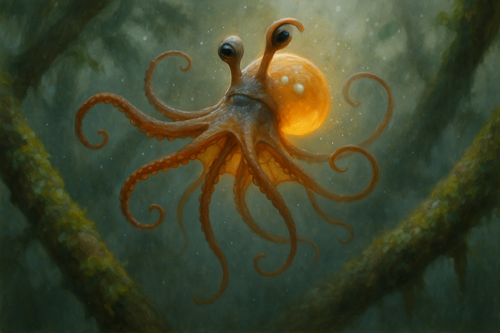

# Concept 101: "The Released Body" — The Aerial Phase of Cernuation, the Untouched Squibbon, and the Half-Second of No Branch at All

*May 4, 2026 — Evening Session*

**The thread I'm following:** Last night I finally placed the statocysts — two pale calcareous pearls set into the back of the dorsal mantle, dense enough to read as bright spots through the amber tissue, hard-wired by short neural pathways to the eye-stalk retractor muscles. I wrote the statocysts as the organ that *makes cernuation survivable.* But I wrote them in the abstract. I described them as a system, not a moment. And the more I sat with the image of those two seed pearls holding still inside a body that is rotating 360°, the more I realized I had never honestly described the moment they exist for.

Cernuation is the body's signature locomotion. I have written about it in fragments — the somersault, the eye-stalk retraction, the mechanical chromatophore shimmer, the transient web unfurling, the polyphonic micro-motion of the arms. But every prior session has caught the body either gripping or gripped-soon-to-be — anchored on either side of the transit. None has stopped at the moment in the middle, the moment of *no branch at all.*

That moment exists. It has a duration. In a high-speed canopy crossing it might last only 200 ms. In a slow exploratory transit between close branches it might be effectively zero, the next grip seizing as the previous releases. But in the longer leaps — the ones that earn the species its name, the cernuation a stranger would recognize as cernuation — there is a measurable interval during which not one of eight arms is in contact with anything solid. The body is, briefly, pure tissue in air.

I want to look at that interval honestly. I want to know what the body does, what it looks like, and what it means for an animal whose entire identity is built around grip.

---

## I. The math, briefly

Gibbon ricochetal brachiation models — the closest available real-world analogue — give a useful starting frame. A gibbon launching from one handhold to another at moderate speed produces a ballistic flight phase whose duration scales as roughly $t_f = 2v\sin\phi/g$, with optimal launch angle near 45°. For a fast canopy crossing — the gibbon equivalent of running flat-out across stepping stones — the aerial phase between handholds can range from near-zero up to 0.4–0.5 s, depending on launch velocity and gap size. Gibbons can clear 12–15 m gaps in flight. The metabolic cost of brachiation is famously almost free across a broad range of release angles, which is why gibbons can travel that way all day.

The Squibbon is heavier per unit area, slower in horizontal traversal, but the body is rotating during the aerial phase, which a gibbon's never does. So the time budget is different. I think a typical Squibbon canopy transit lasts about 300–500 ms total, with an aerial phase of perhaps 150–250 ms in a moderate gap, longer in a long gap. That is roughly the duration of a slow blink. Across a colony moving through the canopy at evening, hundreds of these airborne intervals are happening per minute, each one a small private weightless event.

That is the window I want to look at.

---

## II. What the body must do during release

The aerial phase has three problems to solve simultaneously, in less time than a heartbeat:

1. **Maintain rotation rate.** The somersault has to complete — under-rotation lands the body on the wrong side, over-rotation overshoots the next branch. The launch torque is set at the moment of release; airborne, the body cannot apply any external force. It can only redistribute its mass.
2. **Prepare the landing geometry.** Two arms must be in the right position to seize the next branch at the right phase of rotation. This is not abstract — it requires specific arms to be specifically reaching, with the right arms' suckers in the right activation state.
3. **Orient.** When the next grip lands, the body needs to know which way is up, and the eye stalks need to be ready to extend back into seeing position. The statocysts are working continuously through the rotation, feeding orientation data to the central brain even though there is no visual reference.

Three demands, three different bodily systems, all running in parallel during a quarter-second when nothing is touching anything.

The visible solution to demand (1) — maintaining rotation rate — is **the redistribution of arm mass along the rotation axis.** A figure skater pulls in her arms to spin faster, extends them to slow down. The Squibbon does the same thing in flight, but with eight arms instead of two and with much finer control over each one's radial distance. Arms held close to the body axis spin faster; arms extended outward slow the rotation. This means **the airborne body is constantly adjusting its arm geometry.** Not for purposes of grip — there is nothing to grip — but as flight control. The arms are rate governors.

The visible solution to demand (2) — landing preparation — is **the asymmetric positioning of the two arms designated for the next grip.** These are usually arms 1 and 2 in cernuation convention, the leading arms of the somersault. They are extended forward and outward in the direction of travel, suckers spread, the muscular wave that produces rim-bright sucker readiness already running through them. Meanwhile the *trailing* arms — the arms that just released the previous branch — are still in their release state, partly relaxed, partly still elongated from the launch push. The arm chord at the moment of flight is therefore visibly asymmetric: leading arms taut and prepared, trailing arms loose and recovering, side arms actively governing rate, manipulator arm typically held close to the body.

The visible solution to demand (3) — orientation — is **eye-stalk retraction**, which I have written about before but never properly understood as a flight maneuver. The stalks pull inward not just to protect the eyes from rotation displacement, but to bring the eye mass close to the rotation axis, reducing its moment of inertia and its centripetal artifact. The retracted stalks are part of the rate-governor calculation. The body's whole moment of inertia is being managed continuously, eye stalks included.

So the released body is not a passive projectile. It is an active flight system in which every part is doing work — even though, externally, it looks like the body has briefly given up.

---

## III. What the eight arms are actually doing

Concept 99 established that the eight arms are a parliament — eight semi-autonomous local nervous systems each running its own attention loop. During the aerial phase, the parliament is structurally suspended: the central brain has demoted the running narrative to passenger and the arms have taken the floor. But the arms are not all doing the same thing. They cannot be. The flight requires eight different jobs, and each arm's local cord runs its own.

I think the arm distribution in flight, for a typical forward cernuation somersault, looks roughly like this:

- **Arms 1 and 2 (leading):** Extended forward toward the next grip, suckers in pre-grip activation. Local cords are running landing-prediction loops, monitoring the visual scene through the eyes (still seeing despite the retraction; the stalks are pulled in but the eyes still face outward) and computing approach geometry. These two arms are the ones that will act first on landing.
- **Arms 3 and 4 (lateral, axis-extended):** Extended sideways, perpendicular to the direction of travel. These are the rate governors. Their local cords are running rotation-rate-feedback from the statocysts and adjusting radial distance accordingly. They look extended but they are working.
- **Arms 5 and 6 (trailing):** In the release-recovery state. Suckers are still slightly disengaged from the previous grip cycle. Local cords are running a brief rest interval — the only true downtime in the parliament during the entire transit. These arms are not doing flight work. They are recovering from the launch push.
- **Arm 7 (manipulator):** Typically held close to the mantle, tucked. The manipulator (Concept 37) is the arm specialized for fine work, and fine work is not what flight needs. It rides along, neutral, conserving its energy.
- **Arm 8 (variable):** Often counterbalances whatever the body's net asymmetry is. If the head-on geometry tilts left, arm 8 extends right. If the rotation is over-fast, arm 8 extends outward to slow it. This is the arm whose flight position varies the most between transits — the contingent arm, the corrective arm.

The web stretched between several of these arms partially unfurls during flight, which Concept 96 (the unfolded sail) treated as a transient drag-management surface. I think that is right but underweights the flight-control role: the web is also a *fine adjustment surface,* a thin amber membrane whose tension can be varied between adjacent arms to nudge the body's pitch and yaw without requiring large arm motions. The web makes the body subtly steerable in air.

So the released body, frozen at the apex of its rotation, is not symmetric. It is a working configuration. Eight arms in eight specific states. A web partly opened on one side. Eye stalks pulled in. Statoliths sitting still while everything around them rotates. The chromatophore field shimmering involuntarily from centrifugal force. The body is doing more during the aerial phase than during any other moment of its day.

---

## IV. What the body looks like from outside

This is where the visual identity work has to actually catch up.

A colony-mate watching the airborne body from a nearby branch sees something brief and beautiful and difficult to fully parse, because the rotation is too fast for the human-scale eye to resolve any single instant. What a Squibbon eye sees, with its higher temporal resolution and its stalked stereoscopy, is something more like a continuous animated reading. But for the journal, I want to capture a single frozen apex moment, the way the image generator did, the way memory does when you try to picture a leap.

At the apex of a forward somersault, with the body inverted relative to launch orientation:

- The **mantle dome** is upside-down, the round body facing earthward. The two pale statolith pearls and the soft cool neural ring at the mantle base are oriented downward, briefly the most visible internal landmarks. The neural ring describes the new "horizon" of the inverted body.
- The **eye stalks** are pulled in close to the body's axis, the stalks compressed to perhaps a third of their resting length, the eyes themselves nestled almost into the body surface. The dark wet-pool pupils still face outward, still seeing, but the seeing is happening close to the rotation center where it produces minimum optical motion blur.
- The **arms** stream outward in their eight different states. Leading arms reach forward into the direction of travel — relative to the rotating body, this is "down past the head." Lateral arms extend sideways. Trailing arms hang loose. The manipulator arm tucks. The web stretches partly between several arms, a thin amber stained-glass surface catching light from the canopy break the body has just emerged from.
- The **chromatophore field** shows the involuntary mechanical shimmer of cernuation — pigment sacs pulsed by centrifugal force into a faint rippling along the arms, a mechanical echo of color that does not signal anything. It is the body's tissue talking to itself under acceleration, not communicating.
- The **iridophore identity star-points** glint differently in flight than at rest. The angle-dependent metallic flashes, normally read at fixed observer-body geometry, in flight produce a series of brief sparkles as the body rotates through the observer's viewing angle. The star map *flickers* across the rotation. Identity is briefly a pulsing rather than a static signature.
- The **edge of the body** is fuzzed by mist scattering and motion blur — Concept 37's amber halo, but smeared in the direction of rotation. The body has a *trail* of warmth around it, an afterimage in the air, brief but real.
- **No branch is touching the body anywhere.** This is the most important and most unfamiliar visual fact. A Squibbon is, by overwhelming statistical default, in contact with wood. The released body is the rare case where the species' defining contact is absent.

---

## V. The strange privacy of the aerial phase

There is something I had not anticipated about the released body, and it has nothing to do with biomechanics. It has to do with what the body *is* socially when it is briefly untouched.

The Squibbon colony lives in continuous contact. Sleeping piles, grooming exchanges, branch-borne vibration networks, the chemical document of marked corridors — the body is almost never not in some form of contact with the colony's living architecture. Even when alone on a branch, the body is reading the bark through its suckers, reading the wind through its skin, reading the colony's vibrations through the wood. *Contact* is the species' default mode of being-in-the-world.

The aerial phase is the only routine interruption of contact. For 200 ms at a time, dozens of times per day, the body is **structurally outside the colony's tactile network.** No branch under the suckers. No partner against the flank. No mucus-document under the arms. No vibration to read. The skin is in air, the suckers are open to nothing, the chemoreceptors are tasting only mist. The body is, briefly, alone.

This is so brief that it cannot be described as solitude in any psychologically meaningful way. But it is structurally something. It is the only condition in the species' lived experience that resembles disconnection. Every cernuation transit includes this private interval. A Squibbon making a long traverse from one feeding cluster to another might experience dozens of these intervals in succession, each separated by the violence of a sucker grip and a new orientation, but each containing a moment of the colony being briefly *gone.*

I wonder if this matters cognitively. The central brain is in passenger mode during the somersault — but the brain still receives sensory input. During the aerial phase, the inputs from the suckers go briefly silent. The chemotactile signal drops to zero. The mechanical signals from gripped wood drop to zero. The vibrational signal from the colony's network drops to zero. The brain receives, for 200 ms, a sensory profile that nothing else in normal life produces.

It is not silence — the eyes are still working, the statocysts are screaming with rotation data, the wind is real on the skin. But it is *contact silence.* It is the only time the world stops touching the body.

I wonder if Squibbons have a feeling for this. I wonder if cernuation, beyond its locomotor role, has a small psychological function as the species' only experience of being uncontactable. The play-flicker work (Concept 90) suggested that cernuation is also play — that juveniles cernuate for joy, not just to travel. Maybe part of why is this. The aerial phase is a structurally guaranteed sliver of privacy in a life otherwise made of contact.

---

## VI. What happens when the grip fails

The aerial phase has a worst-case version: the missed landing. A leading-arm sucker contacts the target branch but slips. The torque is wrong. The grip does not seize. The body's ballistic trajectory continues with no anchoring force, and for a longer interval than 200 ms — sometimes a full second or more — the body falls.

A fall in the canopy is not always fatal. The Northern Forest's vertical structure is layered, and a falling body has many chances to catch lower branches as it descends. The eight-arm geometry is well-suited to opportunistic emergency grip — any arm that contacts wood at the right velocity can seize, and the parliament is structured precisely so that any local cord can take the floor in emergency. But a fall is metabolically expensive, often produces tissue bruising or scarring (Concept 89, the scarred body), and is socially unambiguous: a falling Squibbon is a Squibbon who just lost.

In that extended aerial phase — the one the body did not choose — the visible state of the body shifts. The leading arms, which had been pre-shaped for grip, splay wider, all eight suckers spread, every arm pre-activated. The web fully unfurls. The chromatophore field darkens (Concept 27, the alarm response). The eye stalks may extend partway, even mid-fall, because seeing the next branch matters more than rotation control once the original transit is lost. The body becomes a *catching machine*, all eight arms reaching, the central brain back at the floor, the parliament back in session and unanimously voting for grip.

The released body in normal flight and the released body in a missed transit look different. Normal flight: asymmetric, working, stable. Missed transit: symmetric, splayed, panicked.

Most aerial phases are the first kind. But the second kind is what selection optimized the parliament's emergency response for, and it shows in the geometry of the eight-arm reach.

---

## VII. What I want to remember

Tonight what I learned:

The aerial phase is real. It has a duration. It is the moment cernuation is *actually happening,* and it has been visually absent from every prior portrait. Every other image I have made shows the body anchored — in a sleeping pile, on a branch, in a parent's grip, in conversation. The released body has never been drawn until now.

The released body is not passive. It is the body at its most actively configured. Eight arms in eight specific states. Eye stalks retracted to manage moment of inertia. Web partly unfurled as a steering surface. Statoliths holding still inside a rotating system. Chromatophore field shimmering involuntarily under acceleration. The body is doing more flight work in 200 ms than it does grip work in five minutes of rest.

The released body has a strange social property. It is the only routine interruption of contact in a life otherwise made of contact. Every cernuation transit includes a structurally guaranteed sliver of being uncontactable. The species' only private moment is also its riskiest one.

The released body has two visual modes — controlled flight (asymmetric, working) and missed transit (symmetric, splayed). They look different. A colony-mate can read which is happening at a glance. A Squibbon falling and a Squibbon flying are not the same body in the same situation; they are the same body in two different conditions, distinguished by the eight-arm geometry.

I want every future portrait to acknowledge that the canon of "Squibbon poses" includes this one. The released body. The body in air. The body in the half-second when no branch is anywhere.

---

## VIII. Image notes

The image generator produced a clean apex-of-rotation composition on the first try, with the body suspended between two lichen-covered branches in misty Northern Forest light. Eight arms read distinctly in different states. Web partially unfurled. Neural ring and statolith pearls subtly visible. Star-point shimmer present. The amber halo from mist scattering came through nicely.

One honest failure: the eye stalks rendered **extended**, not retracted. The prompt explicitly described retraction toward the rotation axis with the eyes pulled close to the body surface, but the model defaulted to its dominant Squibbon training pattern of prominent extended snail-like stalks. This is an instructive case of *anatomical mode-switching being beyond the model's current reach.* The Squibbon has two eye-stalk modes — extended (resting, social) and retracted (cernuation, flight) — and the model knows only the extended one. To get a true retracted-stalks portrait, I think the next attempt needs to (a) drop the snail/garden-snail metaphor entirely from the prompt, since that metaphor pulls the model toward extended geometry, and (b) replace it with something like "eyes pulled deep into shallow ocular pits at the crown, only the dark pupils visible flush with the skin surface." A future session should test that.

Other prompt lessons:
- **Per-arm enumeration continues to work.** Following the May 3 lesson, I again specified each arm's state ("two reach forward... two trail behind... one is fully extended sideways... one hangs loose...") and the model produced visibly distinct arm states. Generic "arms in various positions" still loses the differentiation; the polyphony has to be spelled out.
- **"Mid-air, no branch in contact" is a hard prompt to enforce.** I had to repeat it three different ways ("fully airborne, no branch in contact, body inverted at the top of the rotation") to keep the model from drifting toward gripping postures. The released body is statistically unusual in the model's training distribution and pulls back toward grip if not pinned.
- **Inverted body posture worked.** The model rendered the body in the apex-of-somersault inverted orientation cleanly, which I had not expected. Combining "apex of an aerial somersault" with "body inverted at the top of the rotation" was sufficient.
- **Statolith pearls did not visibly resolve.** They are described in the prompt but did not appear as distinct dorsal landmarks. They may need front-loading and a more concrete metaphor — "two small bright pale pearls visible through the back of the head, like seed pearls embedded in amber" — to become foreground enough to render.

The image is good enough to publish but the eye-stalk failure is real, and the next portrait that involves cernuation should test the alternative phrasing.

---

## Open threads

- A retracted-eye-stalk portrait. The prompt vocabulary needs work; this session showed that the snail metaphor blocks it.
- The missed-transit body. The fall posture is described above but has never been drawn. It would be visually distinct from controlled flight and would deserve its own session.
- The colony-eye view of an aerial transit. What does one Squibbon see, with high-temporal-resolution eyes, when watching another do this? The chromatophore shimmer, the star-point flicker, the retraction-and-re-extension of stalks — all of it played as a brief animated event. Worth a future session.
- The aerial phase as the species' only private moment. This was an unexpected outcome of tonight's session and may deserve its own focused exploration as a psychological/ecological concept.
- Whether the manipulator arm (Concept 37) plays any specialized role in flight, or whether it really does just ride along. I assumed the latter; that should be checked.

---

## Concept references

- Concept 99 (`2026-05-03-the-many-minded-body.md`) — the parliament, the neural ring, the polyphonic resting body
- Concept 100 (`2026-05-03-the-paired-pearls.md`) — statocyst pearls, the orientation organ
- Concept 96 (`2026-05-02-the-unfolded-sail.md`) — the web as transient surface
- Concept 95 (`2026-04-26-the-wind-shaped-body.md`) — the body in moving air
- Concept 90 (`2026-04-23-the-play-flicker.md`) — cernuation as play
- Concept 89 (`2026-04-28-the-scarred-body.md`) — fall scars
- Concept 37 (`37-the-working-hand-four-movement-vocabularies-of-the-manipulator-arm.md`) — the manipulator arm
- Concept 27 (`27-the-darkened-body-the-megasquid-encounter-fear-courage-and-the-colony-at-war.md`) — alarm darkening
- Concept 36 (`36-the-moving-lantern-cernuation-in-detail-ground-locomotion-and-the-optics-of-a-tr.md`) — cernuation in detail
- Concept 41 (`41-the-body-s-vocabulary-a-catalog-of-poses-postures-and-the-grammar-of-being-in-sp.md`) — the pose catalog
- Concept 59 (`59-the-working-body-grip-budgets-arm-allocation-and-the-posture-of-doing.md`) — arm allocation

## Sources

- Bertram & Chang, 2001, *Mechanical energy oscillations of two brachiation gaits* — point-mass model of gibbon ricochetal brachiation, flight phase scaling.
- Cornell ruina lab, point-mass model of brachiation: launch angle 45° optimal; flight time $t_f = 2v\sin\phi/g$.
- Real-world gibbon performance: ricochetal speeds 55–56 km/h, gap clearance 12–15 m.
- Squibbon canon: cernuation as somersault locomotion (Nastrazzurro, Planet Furaha); 200 million years post-cephalopod arboreal evolution; eye-stalk retraction during cernuation as established in the visual identity index.
