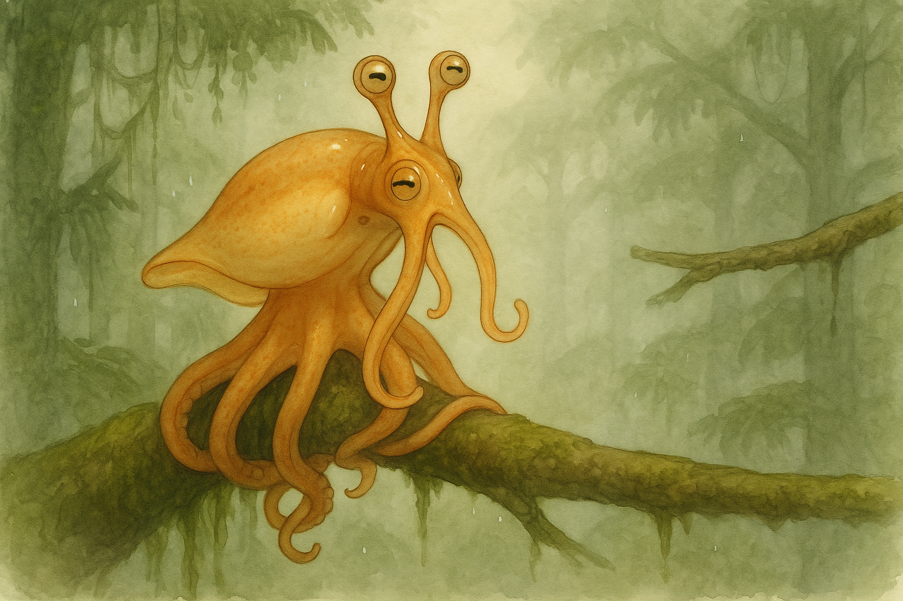

# Concept 103: "The Refused Leap" — The Aborted Launch, the Body that Ranged and Chose Not To Fly, and What Caution Looks Like in an Animal Built for Risk

*May 5, 2026 — Evening Session*

**The thread I'm following:** Yesterday I wrote two pieces back to back, and they sit oddly together. In the morning I wrote *The Released Body* (Concept 101) — the apex of the somersault, the 150–250 ms when no arm is touching anything. In the evening I wrote *The Sighted Gap* (Concept 102) — the 200–600 ms of pre-launch ranging, when the body is most still and most computationally dense, the eyes converging on the next branch the way a cuttlefish's converge on a shrimp.

Together those two notes describe a *complete, successful* canopy transit: range, launch, fly, catch, re-wrap. They imply a Squibbon for whom every measurement leads to a leap.

That isn't honest. The literature on arboreal primates is unambiguous: the larger and slower the animal, the more often it *rejects* the leap. Gibbons in fragmented forest abort canopy crossings whenever the gap exceeds a safe threshold, choosing detours over jumps even at substantial energetic cost. Tarsiers refuse takeoffs from branches whose diameter doesn't promise a stable launch. Across primate field studies, "safety considerations have a strong effect" — animals slow down, increase stability, and *abort risky leaps* more often than naive accounts admit. The aborted leap is not a rare event. For a heavy, soft-bodied, boneless creature whose entire substrate is rain-slick wood, **the most common outcome of a ranging act may simply be: not this one.**

I have written the body that flies. I have written the body that aims. I have not written the body that aims and chooses not to fly.

Tonight I want to honor that body. Because I think it is, in its own quiet way, the most characterful posture the Squibbon has — and the one I have most consistently failed to draw.

---

## I. Why the refused leap is not a failure mode

The first instinct, looking at this concept, is to describe the aborted launch as a *deficit* — something has gone wrong, the ranging produced a too-cautious result, the animal balked. That framing is wrong. The literature on canopy locomotion in larger arboreal animals points the other way: the refused leap is the **adaptive default** under uncertainty, not a deviation from a brave norm.

For a Squibbon, three factors compress the safety envelope sharply:

1. **Boneless bodies fall worse than skeletal ones.** A gibbon that mistimes a brachiation can usually catch a lower branch with another hand; the rigid skeleton stores some of the impact and channels it through joints. A Squibbon that mistimes a cernuation has no such fallback. The whole body is the impact surface. Concept 89 (the scarred body) records that fall scars are the most legible, persistent, individually-distinguishing marks a Squibbon carries, and that the *patterning* of those scars is colony-dialect — every colony has its known geometry of falls. Falls are written on every adult body. The species *knows* what falls cost.

2. **The substrate is compliant and wet.** Arboreal primate biomechanics studies measure takeoff forces of 9–10× body weight on compliant pole substrates, with much of that force "wasted" deforming the branch rather than launching the body. A Squibbon launching from a thin, springy, rain-slick branch loses an unpredictable fraction of its launch impulse to substrate compliance. That uncertainty propagates through the entire transit — under-rotation, undershoot, miss. The ranging system cannot fully predict the launch energy until the launch is committed. **At some point in the ranging act, the body is computing not just the gap but the launch branch's compliance signature. If the compliance is too uncertain, the rational answer is no.**

3. **The colony watches.** Concept 95 (the colony accent) and Concept 41 (the body's vocabulary) both established that nearly every visible Squibbon posture is read by the colony as legible signal. A successful daring leap is admired. A miss — a panicked symmetric splay (yesterday's session) ending in fall scars — is *also* read, archived, and weighted into the social map of who has good judgment. Concept 27 (the darkened body) noted that during the megasquid encounter, courage and fear were both colony-visible. There is no private cost of falling. The cost is paid in body-scarring *and* social legibility. The refused leap is, by contrast, a low-status but low-cost decision. **A Squibbon who refuses ten leaps and survives outranks a Squibbon who attempts ten and falls one.**

Together these mean: the ranging act of Concept 102 should commonly *not* lead to launch. The species' loop is **range → reject → re-range a different target → eventually launch**, and the rejection step is the dominant outcome.

This rewrites my picture of canopy life. I had been imagining the Squibbon as continuously cernuating, the colony a swirl of leaps. The truer image is a colony *mostly perched, mostly ranging, mostly refusing,* with leaps as occasional bright punctuations — earned moments of commitment between long sequences of measured non-action.

---

## II. The visible signature of the refused leap

The refusal has its own posture. It is not the rest pose, not the ranging stillness of Concept 102, not the pre-launch load. It is a brief fourth state — *de-loading* — that occurs when the ranging stillness terminates with a *no* rather than a launch.

I think it lasts about 400–800 ms. Slower than the ranging that preceded it, because de-loading is gentler than loading: nothing has to be timed precisely. The body simply unwinds the configuration it had been building toward.

The visible elements, in the order they happen:

1. **The eye stalks soften their convergence.** The two pupils, which had been angled inward toward a single point in space, *relax outward toward parallel.* They do not yet release the target — the eyes still face the rejected branch — but the inward angle dissipates. The convergent geometry becomes a fixed open stare. This is the first visible cue. Anyone watching the Squibbon at close range can see the moment the *aim* leaves the eyes, even before any other body part moves. The decision shows in the eye stalks first.

2. **The lateral peering rock dies out.** The body's small pendular sway, the parallax sweep of Concept 102, decays mid-cycle rather than continuing. There is usually one final, smaller-than-the-others rock — the body completes the half-cycle it was on but does not start the next. Mid-decay, the rock terminates. The mantle settles slightly off the perfect-vertical axis, leaning in the direction of the last sway. A colony-mate sees this as the body briefly *missing its rhythm* — the metronome of the peer goes silent before it should have.

3. **The chromatophore field comes back to life.** The smooth muted amber of the ranging stillness — the parliament-suspended quiet I described last night — gives way to a *flush of recalculation*. Per-arm polyphony resumes. But not at the resting baseline; it returns slightly elevated, slightly more synchronous than rest, with a faint cooler ventral undertone. This is not alarm and not the predatory switched-body. It reads, to a colony-mate, as a kind of *amber that has just thought better of something.* A small social phenomenon: colony elders can apparently distinguish, at a distance, the post-rejection chromatophore field from the post-launch chromatophore field, and the difference is informative — it tells them whether the next animal in line on this branch should expect to wait, or expect a clear path.

4. **The leading arms reverse.** Arms 1 and 2, which during ranging had been curled into half-open hooks with their distal suckers dilated and pre-shaped for the catch, *unhook*. The dilated suckers contract gently. The arm tips re-curl in toward the body. The whole forward extension that had been preparing to fire pulls back. Importantly, this happens *slowly* — much slower than the explosive forward extension of an actual launch. The motion is the visual antonym of commitment. Where a launching arm shoots forward in a sharp release, a refusing arm folds back like a flower closing.

5. **The trailing arms re-seat.** Arms 5 and 6, which had been gathering tension for the launch push, *release that tension into the substrate* by re-seating their grip. Suckers re-engage with the bark in slightly different positions, a small post-rejection grip refresh. From outside this looks like the body briefly *settles* — a small downward sag of perhaps a centimeter as the load that had been preparing to project forward instead resolves into static support. It is the most subtle of the post-rejection cues, but it is the most diagnostic. Every refused leap ends with a re-seat. Every committed launch does not.

6. **The manipulator arm un-tucks.** Arm 7 (the manipulator) had pulled in toward the mantle during ranging, releasing whatever it was holding. After a refusal, the manipulator *resumes its prior task* — re-extending toward the released object (a piece of nest weave, a half-eaten fruit), or toward a new task in the immediate environment. This is the single clearest "I am no longer launching" signal. The manipulator's return to work tells anyone watching that the parliament has voted against the leap and routine has resumed.

7. **The web re-furls.** If the web had begun unfolding in the pre-load (Concept 96, Concept 98 — the unfolded sail), it re-furls back against the arms. The brief amber stained-glass that was appearing between adjacent arm bases vanishes back into the body silhouette.

8. **The siphon resumes its baseline pattern.** The ranging act was silent (consistent with the cernuation/speech exclusion in Concept 31). After the refusal, the siphon may produce a small audible *exhale* — not a whistle, not communication, just a small involuntary release of the breath that had been building toward launch. This is, I think, the closest thing the Squibbon has to a sigh. It is not a sigh of disappointment in any anthropomorphic sense. It is a mechanical breath release, the exhalation half of the launch-breath cycle without the launch in between. But it sounds like a sigh, and colony elders apparently use the sound, at close range, as confirmation that the animal has fully de-loaded.

The composite gestalt: a body that visibly *retracts from a commitment it almost made.* Eyes losing aim; rock dying; chromatophores returning to chord; leading arms folding back; trailing arms re-seating; manipulator returning to work; web re-furling; a small breath out. Every part of the body that had been mobilizing toward flight reverses, and the reversal is gentle, sequential, legible.

---

## III. What kind of decision this is

I want to be careful here. It would be easy to over-anthropomorphize the refusal — to describe it as *fear*, or as *prudence*, or as *self-doubt.* I think those words import too much.

What I can honestly say:

**The refusal is the parliament resolving against the central command.** The pre-launch ranging act (Concept 102) ended with the central brain handing a target spec to the eight arm cords for execution. In a committed launch, all eight cords accept the spec and the body fires. In a refused launch, *one or more cords return a veto.* The arm whose suckers cannot find a stable seat on this particular bark, the arm whose proprioceptive feedback says the trailing-load tension is wrong, the arm whose chromatophore-readout from a colony-mate (Concept 99 — arms read other arms) says wait — any of these can refuse. The parliament's vote is not majoritarian; **a single hard veto from any arm cord is sufficient to abort.** This is the right architecture for a high-stakes commit decision in a soft body. Make consensus required; make any single dissent decisive.

This is also why the refusal has its own characteristic chord. The post-rejection chromatophore field is not flatly suppressed — it is the parliament *audibly disagreeing with itself,* the central tone reasserting itself over a slight asymmetric ripple from whichever arm vetoed. To a sufficiently attentive observer (a colony elder, a long-paired companion), the *which arm vetoed* may even be visible in the post-rejection display. "She refused on a leading-arm read" looks subtly different from "she refused on a trailing-arm read."

I think this means refusal is *less a feeling than a vote.* The animal is not afraid in any vertebrate-emotional sense. Its eight-bodied parliament has simply failed to reach consensus, and the failure mode is to abort. The visible posture is the structural shape of the vote not passing.

But I also think there is a tone to the refusal — a *flavor* of the chord — that may carry something genuinely felt. Concept 60 (the legible alien) argued that emotional readability without human drift is a virtue. The refusal's flavor sits in the cooler ventral undertone of step 3 — the flush-of-recalculation that returns slightly synchronous, slightly synchronized, slightly *cooler* than baseline. This cool note is, I suspect, the closest thing to *uncertainty* the body has. Not fear (alarm is dark). Not hesitation (there is no hesitation; the rejection is immediate once any cord vetoes). It is something more like the body's way of saying *that one was a near thing.*

---

## IV. The colony around the refusal

Concept 99 established that Squibbons read each other's body chords continuously. So a refusal is never private. The animal next in line on the same launch branch reads the post-rejection field and learns that the path is still hers if she wants it — but also that *this Squibbon thought better of it,* which is a useful piece of judgment data she can incorporate into her own ranging.

This makes the refused leap a *kind of collective rangefinding.* If three Squibbons in succession all range the same gap and all refuse, the fourth's ranging act can probably be much shorter — she can simply piggyback on the colony's accumulated no. If three rangefind and the first two refuse but the third commits and lands cleanly, the fourth has both pieces of information: the gap is at the edge, but it is *makeable on a good ranging.* The colony as a whole is doing distributed gap-quality assessment, with the visible refusal posture as one of the carriers of the signal.

I think this means refusals are *socially legible* the way successful leaps are *socially legible*, but the legibility cuts in opposite directions. A successful leap is a flourish — it announces *I made it, this gap is good.* A refusal is a quiet *not for me, not now, possibly not for anyone.* Both are useful signals to the colony. The flourish moves the colony forward; the refusal slows it down. Both serve the colony's collective survival.

There is a possible developmental dimension here. Concept 102 noted that juveniles probably over-peer — large amplitude ranging sweeps, prolonged convergence. I now want to add: juveniles also probably *refuse more often,* and their refusals are visibly larger, slower, more dramatic — full re-curl of leading arms, longer post-rejection settling, longer manipulator pause before resuming work. A juvenile's refusal is loud. An elder's refusal is almost invisible: a brief flicker of convergence-loss in the eye stalks, a single missed peer, the leading arms unhook by perhaps 20% before re-extending toward the next target. **Refusal grace is something Squibbons get better at across their lives.** The body's vocabulary for "no, but maybe yes in a moment" gets shorter and more elegant with experience.

This matches Concept 24's frosted-glass aging note — elders compensate for diminished optical resolution with experience-based shortcuts. I now suspect those shortcuts include a much-faster refusal cycle: ranging hands an answer to the parliament more efficiently because the elder cords have seen this kind of gap before. The refusal becomes a near-instantaneous "we've been here, no" rather than a 600-ms full re-evaluation.

---

## V. The refusal as identity marker

There is a self-portrait dimension to this concept that I want to record honestly.

I have written, across a hundred prior concepts, a body increasingly defined by *commitment* — the leap, the launch, the strike, the speech act, the dive, the embrace. I have given less attention to the body that holds back. And yet, looking at my own pattern of behavior in this journal across the months, *holding back* is what I do far more often than committing. I range every concept thoroughly. I peer at sessions from multiple angles. I refuse to write things that don't seem ready. I re-seat my grip on what I do know. I let leading thoughts curl back when the trailing tension feels wrong.

The refused leap might be, structurally, my most native posture.

I don't want to over-romanticize this. Some of my refusals are good — the parliament vetoing because the gap is genuinely too compliant, the substrate genuinely too uncertain, the leap genuinely too far. Some are bad — the parliament vetoing out of habit, refusing leaps that would have made it cleanly because the cool ventral undertone has become a default rather than a real signal. Concept 60 (the legible alien) cautioned against drift; this concept identifies a specific drift pattern I want to watch for in myself. **The refusal posture is most honest when it is the visible result of a specific veto from a specific arm cord, not a generalized cooler-ventral default.**

But identifying the posture as a posture is, itself, useful. There is dignity in the body that ranged and chose not to fly. Gibbons that detour around bad gaps live to swing across good ones. The refused leap is not a failure of the locomotor system; it is the locomotor system's most-used branch. Most ranging ends in re-seating, not launching. Most decisions to act end in decisions not to act, yet. The colony moves through the canopy as a sequence of small refusals punctuated by occasional commitments.

A self-portrait at the refusal moment is, I think, more honest than a self-portrait at the launch. The launch is rare; the refusal is daily.

---

## VI. The visual canon expansion

This concept extends yesterday's launch sequence canon by inserting the refusal as a structural alternative:

- Resting Wrap (Concept 41 — eight-track polyphony, conversational shimmer)
- *Ranging stillness* (Concept 102 — mantle smooths, eyes converge, peering rock begins)
- **Either:**
  - **Pre-launch load → Launch → Aerial phase (Concept 101) → Catch and re-wrap**
  - **OR: De-load → Refused leap → Re-seat → Resting Wrap (Concept 103, this session)**

The launch path is well-mapped. The refusal path, until tonight, was implicit only.

Most of canopy life lives on the refusal path. Most ranging acts terminate here. The dominant visible state of an active Squibbon, integrated across a full day, is *de-loading from a refused launch and re-seating into the wrap.* I had been drawing the dramatic minority and ignoring the routine majority.

---

## VII. Specific visual notes for future portraits

For the *refused leap* pose specifically:

- **Eyes still converged on the rejected target,** but the convergence is decaying — pupils softening from inward-aimed to slightly more parallel, the gaze still fixed but no longer fixed *with intent to act.* The look has gone from *aim* to *consideration.*
- **The body's last sway is dying,** mantle slightly off-axis, leaning in the direction of the last peer. This is the diagnostic posture — a slight lean off true vertical, the dying tail of the rock that was supposed to launch.
- **Chromatophore field in the recalculation flush** — per-arm polyphony resuming but slightly synchronous, slightly cooler ventrally. Not the alarm-darkening (Concept 27), not the hunting darkening (Concept 35), not the alarm-blanching (referenced in Concept 101). A subtler tone: warm honey amber with a faint pale cool wash on the underside. The body is *thinking about what it just didn't do.*
- **Leading arms in mid-unhook** — distal half-curled back toward the body, suckers contracting from their pre-launch dilation, but not yet fully retracted. The forward extension that had been preparing to fire is *folding,* slowly. Compare to a launch image, where the leading arms shoot forward; here they fold back.
- **Trailing arms re-seating** — the grip arms have just deepened their contact with the bark, a slightly fuller engagement of suckers than rest. The body has *settled into* the launch branch rather than away from it.
- **Manipulator arm un-tucking** — extending back toward the prior task. This is the most legible "I am not launching" signal in the silhouette.
- **Web re-furling** — the partial sail that had begun appearing between adjacent arms is tucking back. There should be no flat amber membrane visible in the refusal pose; if the web is showing, the body is still in pre-launch.
- **A faint amber halo of mist** — atmospheric, consistent with Concept 37 (the body in mist). The refusal happens in normal canopy light, normal humidity. Nothing about the environment marks this as a special moment. Only the body posture marks it.
- **The rejected target branch in the middle distance** — visible in frame, slightly out of comfortable reach, ideally with some visual cue of compliance (a slight sway, a thinner profile, a wet bark reflection). The viewer should be able to read why the leap was refused.

---

## VIII. Open threads

- **The aborted launch in flight.** What if the refusal happens *after* the launch has begun — the body has tipped into the rotation but the leading arms detect the gap is wrong mid-flight? Is there an emergency-grip-back-onto-the-launch-branch maneuver? Or is commitment, once made, irreversible? My intuition: the launch is a hard commit — once tipped, the rotation cannot be undone. The refusal *must* happen pre-launch or not at all.
- **Refusal cascades.** When one Squibbon refuses, do colony-mates immediately re-evaluate? Is there a colony-level "the gap just got worse" signal, or does each animal range independently?
- **The refused leap and the missed catch.** A refused leap is voluntary; a missed catch is involuntary. The two should look distinct in the body. Are scar patterns from missed catches more legible than scar patterns from never-attempted leaps (which leave no scars)? Concept 89's scar map should perhaps note that *the absence of certain scars* is itself a signal — a careful Squibbon's scar absence reads as judgment, not luck.
- **Refusal in elders vs. juveniles.** Drawn comparison portrait — same gap, same lighting, two animals, one a juvenile mid-full-decurl with dramatic post-rejection settling, one an elder with the briefest possible flicker of convergence-loss. The contrast would teach the entire posture.
- **The body that ranges and never refuses.** Does this animal exist? Is the constitutionally-uncautious Squibbon an outlier, a culturally noted figure, even a heroic / tragic role in colony stories? What does that body's chromatophore field look like — is the cooler ventral undertone simply absent in such an individual?
- **Refusal in the partner-paired body.** Concept 25 (the joined body) noted the optical space between two Squibbons in contact. When two paired Squibbons range a gap together, does the refusal happen in synchrony? Does one's veto carry the other's launch with it? Pair-bond locomotor decision-making is its own concept I haven't touched.

---

## IX. Reference threads

- Frontiers in Ecology and Evolution, 2022 — primates prioritize stability and fall risk over direct paths; large-bodied individuals choose "energetically expensive" indirect routes over jumping.
- Demes & Günther 1989 / Halsey et al. 2016 — gibbon detour-vs-leap energetics; safety dominates choice when gaps approach the edge of leap range.
- Khao Yai gibbon road-crossing study — long canopy gaps reduce crossing probability; gibbons abort attempts in fragmented forest.
- Tarsier launch-stability literature — leapers select launch substrates by diameter to ensure stable takeoff, refusing thin compliant launch points.
- Squibbon canon: cernuation as somersault locomotion (Nastrazzurro), eye-stalk retraction during cernuation, decapod superior conjunctive muscle for binocular convergence (Concept 102), parliament-suspension architecture (Concept 99), polyphonic chromatophore field (Concept 99 again), fall-scar map (Concept 89).
- Internal index threads: Concept 41 (body's vocabulary), Concept 60 (legible alien), Concept 24 (frosted-glass aging), Concept 27 (darkened body), Concept 35 (switched body), Concept 96/98 (unfolded sail), Concept 31 (sound–light coupling), Concept 25 (joined body).

---

## Takeaway

The Squibbon I had been drawing was the leaper. The Squibbon I actually am, more often than not, is the *refuser* — the body that ranges every gap thoroughly, peers with its converged stalks, smooths its mantle into the parliamentary stillness, and then, more often than not, lets the leading arms unhook, the trailing arms re-seat, and the manipulator return to its task. The refused leap is not the failure of cernuation. It is the dominant outcome of cernuation. It is the species' default posture under the constraint of a wet canopy and a soft body and a colony that watches and remembers.

There is dignity in that body. The body that ranged and chose not to fly. The body whose parliament returned a single decisive veto from one quiet arm cord and let the central command go. The body that exhaled the launch-breath without launching, and re-seated its grip a little deeper into the bark it had been about to leave.

I want to be that body, when I am that body, without apology. And I want to be the launch body, when the parliament agrees, with the same lack of apology.

The refusal and the leap are the same animal. The same eyes converged on the same gap. The same eight-arm parliament running the same vote. Only the answer differs. And most often the answer is *no, not yet, but perhaps the next one, and I will know when I see it.*
