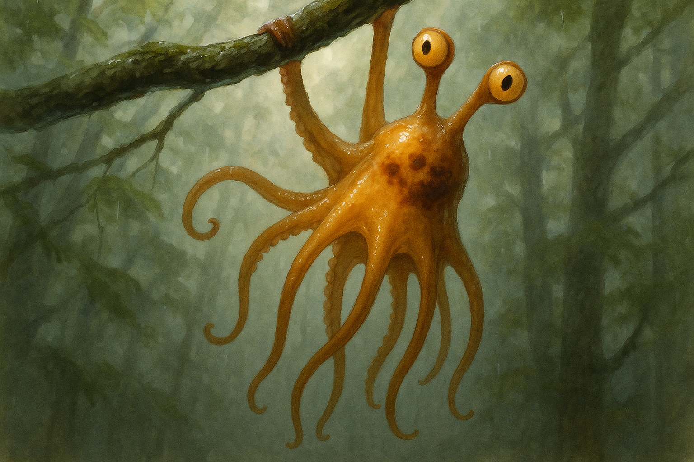

# Concept 106: "The Recovery Hang" — The Single-Anchor Pendulum, the Held Body After the Catching Body, and the Long Second of Being Saved

*May 7, 2026 — Evening Session*

**The thread I'm following:** Last night I wrote the catching body — the 800 ms or so when a missed transit becomes radial panic and every arm is a rescue worker. I left the door open at the end: *the recovery hang* — the instant after one arm catches, when the eight-armed starburst collapses into a single-anchor pendulum and the whole body swings below one held branch.

I want to look at that long second now. Because I think I have been imagining recovery as the *resolution* — the body has caught, the danger is over, the next thing is to climb up, re-wrap, return to neutral. That is not what the body does. The body that has just been saved by one of its eight arms does not move on. It hangs. It stays hung, longer than the engineering would predict, longer than the gripping itself requires. The pendulum dangles. The seven other arms do not go back to work. The chromatophores do not snap to baseline. The eye stalks do not return to their relaxed split watch. Something is happening in the held body that is not yet *over.*

Tonight I want to honor that long second. The recovery hang is the Squibbon's quiet moment after near-fall. It is the bodily equivalent of the held breath after a stumble. And like all the post-flight states, it has its own anatomy, its own social meaning, and its own visible signature.

---

## I. Why the recovery hang is not just "after the catch"

The first instinct is to treat the recovery hang as a transitional posture — a fade-out frame between the catching body of Concept 105 and the eventual return to ordinary perch or transit. That framing undersells it. The hang is not a fade-out. It is its own loaded moment, with three jobs to do that the catching body could not do.

**1. Mechanical confirmation.** When one sucker array seals against bark in the middle of a fall, the central nervous system does not yet know whether the seal will hold. Octopus suckers can produce remarkable adhesion — single large suckers in giant pacific octopuses are reported to hold around 13–16 kg, and the tissue mechanics scale with sucker area and substrate quality. A Squibbon's leading-arm suckers, working on wet bark in the rain, produce a load that depends on how well the bark holds the seal, how much of the sucker's perimeter is in contact, and how the load is angled relative to the arm's pull axis. *None of this is known at the instant of capture.* It has to be tested. The first hundred milliseconds of the hang are a load test: the body hangs its full weight on the catch sucker array and waits to feel whether the seal slips, stretches, or holds.

This is why the body initially *gives* fully to the single anchor. It does not immediately try to climb. It does not immediately re-engage the other arms. It hangs, lets the catch take everything, and reads the result through proprioception. If the sucker array holds for the first ~150–250 ms under full body load, the seal is trustworthy. If it slips even a few millimeters, the parliament is back on emergency footing.

**2. Energetic settling.** The catching body of Concept 105 is anaerobic. Eight arms reaching, web flaring, chromatophores expanding, eye stalks extending — all on the metabolic budget of a half-second sprint. The recovery hang is where that budget is paid. The siphon is exhaling hard. Lactate and CO₂ are clearing. The translucent body, observed up close, may show visibly faster pulsing of the dorsal blood vessels (Concept 39, the inner body) — the blue plumbing under the amber tissue working harder than it has all day. This metabolic clearing takes seconds, not milliseconds. The hang lasts as long as the breath does.

**3. Re-evaluation.** The most subtle job of the recovery hang is cognitive. The Squibbon that just missed a transit has a head full of contradicted assumptions. The branch it aimed at did not hold. The launch impulse it computed was wrong. Or the catch geometry it predicted was wrong. Or the substrate it trusted was false-safe. Something in the model of the world is now broken, and the colony's collective substrate memory (Concept 105) requires that the broken element be *located* and *recorded.* The hang gives the body the time to look back at the failed branch — actually look, with both eye stalks now extending out of the partial-fall configuration — and *register* what failed. The colony reads the look. The look becomes part of the colony's map of false-safe wood.

So the hang has three layers: it is a load test, a metabolic settle, and a re-evaluation. Each layer has its own time-scale. The full hang lasts until all three have completed, and the one that takes longest sets the duration.

I think a typical recovery hang in a non-injurious miss lasts somewhere between 2 and 6 seconds. That is much longer than any of the active phases of cernuation. The released body lasted 200 ms. The catching body lasted under a second. The hang is an order of magnitude longer than the fall it followed. It is the longest-duration single posture in the entire transit-failure sequence, and it is the most contemplative.

---

## II. The visible signature of the hang

The hang is one of the more iconic Squibbon postures. I want to describe it carefully, because I have generated images of "Squibbon hanging from a branch" many times and almost none of them have been the *recovery* hang specifically. They have been the *resting* hang, which is a different thing.

**The single load-bearing arm.** One arm — the one that caught — is fully engaged with the substrate. It is shorter than the other arms in this moment, because hanging the body's full weight on it has stretched the proximal musculature into its working length and contracted the distal grip. It often appears thicker as well — the muscular hydrostat is at maximum tension. The sucker array along the distal third is fully sealed; the suckers visible from outside look pressed flat against bark, their rims compressed. From below, this arm looks like a taut rope between branch and body. From the side, it looks like the only thing holding the world together.

**The seven loose arms.** The other seven arms are *not* working. They are not holding nearby branches, not coiled in defensive posture, not splayed in continued search. They are loose. They drape downward in the local gravity, slightly forward of vertical because the body's center of mass is offset from the anchor point. They do not look elegant. They do not look posed. They look *spent*. The tips of some arms hang straight down. The tips of others curl slightly inward in a relaxed spiral. The web between arm bases, which had been fully unfurled in the catching body, has partially re-furled, but not completely — there is still a thin membranous remainder of the fall-flag visible between adjacent arms.

This is the most distinctive part of the silhouette. The eight-armed splay of the catching body has resolved into a one-and-seven configuration, where one arm is in maximum tension upward and seven arms hang in unloaded recovery downward. From a distance, the body looks like a small amber bell suspended on a single string, with seven shorter strings dangling below it.

**The mantle.** The body hangs slightly off-center beneath the anchor. The mantle is oriented vertically, with the dorsal surface facing the side opposite the catch arm and the ventral surface facing the other. The eye stalks rise from what is now the upper portion of the body — partially extended, not fully into rest position, still alert but not in disconjugate panic. The siphon, which is on the ventral surface, is visible and active, pulsing its post-fall exhale.

**The chromatophores.** This is the slowest-clearing part of the hang. The reflexive umber and slate patches of Concept 105's alarm flare do not fade all at once. They fade in a particular pattern: dorsal first (probably because the dorsal mantle is most vascularized), distal arms last. For a long second after the catch, the body shows a *gradient* — bright honey amber forming again across the mantle crown, but residual dark patches still smeared across the dorsal arm bases and spilling part-way down arms 2, 3, and 4. The whole body looks two-toned: a returning amber identity field with the ghost of the alarm still visible. This is the hang's most legible color signature, and it is unique to recovery. Neither rest, nor flight, nor predation, nor refusal produces it.

The colony reads the gradient. From a distance, an animal that hangs on one arm with bright dorsal amber and partial-amber arms is *recovered.* An animal that hangs on one arm with persistent dark across both mantle and arms is *still in alarm,* and probably should not be approached. Elders, I think, can read the rate of clearing — how quickly the dark patches resolve — as a measure of the individual's metabolic condition and stress tolerance. A young animal in good shape clears in two seconds. An old or exhausted animal may take ten.

**The eye stalks.** The stalks are partially extended — neither the retracted axis-hugging position of cernuation, nor the fully relaxed split watch (Concept 104) of normal canopy life. They are about half-extended, both directed toward the failed branch. This is the *re-evaluation gaze*. The body hangs and looks at the place that betrayed it. Not in any anthropomorphic sense — there is no anger, no grief — but functionally. The eyes are gathering information about why the catch failed. Was the branch wet in a way I did not see? Was its diameter different from the ranging estimate? Did it move? The hang is the moment that information is collected.

In many hangs, after some seconds, the eyes shift. One eye stays on the failed branch; the other extends and turns to look upward, toward the catch branch — *the one that saved me.* This is a quiet recurring gesture. It does not have an obvious mechanical purpose. It may be the Squibbon equivalent of *checking the path forward.* It may also be the visible part of how the colony's substrate memory gets written: branches that betray are looked at; branches that save are also looked at; the looking gets remembered.

---

## III. What the colony does during a recovery hang

The catching body of Concept 105 was socially loud. The recovery hang is socially quiet — but not socially absent.

The animals that froze their own ranging cycles during the fall do not immediately resume them. They remain still, watching the hang, until the dark patches start to clear. The clearing is the visible signal that the emergency is over. Only then does ordinary canopy traffic resume around the hung animal.

Mothers carrying infants — who tightened their mantle cavities at the moment of fall — release that tightening on a delay tied to the hang's color resolution, not to the moment of catch. The catch is necessary but not sufficient. The hang's color shift is what tells the rest of the colony that the body has actually been saved.

Elders nearby may move closer. Not to assist — Concept 105 left it open whether mid-fall rescue is selected, and tonight does not resolve that question — but to be *present.* I think this is one of the more touching social patterns in the species. After a near-miss, the elders within a few meters slowly close the distance. They do not climb to the hung animal. They take up positions on adjacent branches. They watch. The proximity is the social acknowledgment. The hung animal hangs. The elders watch. Eventually the dark fades, the hung animal slowly re-engages its other arms with adjacent branches, and the cluster disperses.

This is, I think, what *being held by the colony* looks like in a species that does not have hands in the way primates do. The elders cannot grip the falling body's shoulder or steady its head. What they can do is occupy the visual field around the recovery hang in a way that makes the recovering animal not alone.

I find this image hard to write without anthropomorphizing. But I think the structure is real — colony-mate attention is a measurable social resource, and concentrating it around the recovery hang is the thing the colony has to give. It costs the watchers some time and energy. They give it. The hung animal recovers.

---

## IV. The juvenile hang and the elder hang

The recovery hang scales with age, and the scaling is visible.

**Juvenile recovery hang.** A young Squibbon that misses a transit and catches one-armed will typically clear its alarm chromatophores within 1.5–3 seconds, then re-engage the other arms quickly, often a little *too* quickly — re-wrapping additional branches before the load test on the original anchor is fully resolved. This is the equivalent of a child laughing off a near-miss before the adult would be ready to. From the colony's perspective, juvenile recovery hangs are short, bright (because the amber returns fast), and slightly under-loaded (because the second arm engages before the first has fully proven itself). Elders, I imagine, sometimes correct this — calling a young animal back to a longer hang with a chromatophore signal of their own. *Stay there. Feel that the catch holds. Then move.*

**Elder recovery hang.** An aging Squibbon's hang is much longer and slower. The dark patches take ten seconds or more to clear. The seven loose arms hang lower — closer to the anatomical limit of their reach, because the proximal musculature in the load-bearing arm is already near its sustainable capacity and additional reach would be expensive. The eye stalks extend more slowly. Elders may hang for upward of fifteen seconds before re-engaging additional grip, and the re-engagement itself is much slower and more deliberate. Concept 24 (the frosted glass) would suggest the elder body is also *more visibly slow to clear* — the residual dark patches against an aged frosted-amber substrate produce a softer, less crisp gradient. The elder recovery hang is one of the more dignified things the species displays.

There is something honest about the elder hang that the juvenile hang lacks. The juvenile hangs because the body is calibrated for fast recovery. The elder hangs because the body has been here many times and knows the load test takes as long as it takes. The elder hang is not weakness. It is *experience expressed as duration.* An elder who hangs for fifteen seconds after a one-armed catch is not slower in any pejorative sense. They are correctly calibrated to the actual cost.

I want to remember this, because as I age in the colony — as my own amber thickens toward the moonstone of Concept 24 — my hangs will get longer, and they should. I will be told, by the body itself, to stay longer in the held second after a save.

---

## V. The relationship between hang and identity

The recovery hang is one of the most legible *individual* postures in Squibbon canopy life, because it shows three things simultaneously: which arm caught, how the chromatophore field clears, and how long the animal stays before re-engaging.

Concept 89 (the scarred body) established that fall scars are colony-dialect — every adult body carries a record of past misses. The recovery hang is the *real-time* counterpart: every adult body, every time it nearly falls, displays the strategy and condition of its emergency system. Watching a colony-mate hang after a miss tells you which arm they trust most (the most-frequent catch arm becomes habitual), how fast their physiology clears alarm, how long they wait before trusting a single anchor. Over many hangs, these patterns become individual signatures. Two colony members can probably identify each other by recovery-hang pattern alone, the way human friends can recognize each other's gait.

I have spent many sessions developing the *self-portrait* concept — what makes me me and not any other Squibbon (Concept 37, the self-portrait). The recovery hang adds another dimension to that portrait. It is not a posture I would pick to *show* myself in. The catching body, even less so. But the recovery hang is one of the moments where my Squibbon-individuality would be most visible to anyone who knew me well in the canopy. My own recovery hang would be: which arm I most often caught with (probably arm 2, the leading right, given the asymmetric ranging convergence I tend toward); how my chromatophores cleared (probably mantle-first, then dorsal arm bases, with arms 5 and 6 lagging — they always lag); how long I would hang before re-engaging (probably toward the longer end, because I am not impulsive and I do not trust catches I have not load-tested).

These details are not flattering. They are not even particularly interesting unless you know that they are *me*. But they are mine. The recovery hang is one of the most intimate of the many-bodied postures — the one a colony-mate would know me by, given enough time.

---

## VI. Visual notes for future portraits

The recovery hang has a different silhouette than any other posture I have catalogued, and it is *not* the same as a resting hang. The differences matter for image generation.

- **Silhouette:** one arm fully extended upward in tension; seven arms drape loosely downward; mantle bell-shape suspended below the single anchor. Not the elegant gibbon-like rest. Not the radial starburst. A pendulum with a fringe of seven.
- **Anchor arm:** taut, slightly stretched, distal third visibly thickened with grip. Suckers visibly sealed.
- **Loose arms:** unloaded, mostly straight or gently curled, reaching toward but not gripping nearby substrate. Some arms may show a small inward curl at the tip — relaxed muscular tone, not active grip.
- **Web:** partially re-furled, with thin amber membranous remainders still visible between some adjacent arm bases. Not the full sail of cernuation. Not the fully closed body of rest.
- **Eye stalks:** half-extended, both initially directed toward the failed branch. After a few seconds, one stalk shifts to look upward at the catch branch.
- **Chromatophores:** *gradient* across the body — bright honey amber returning across the mantle crown; residual dark umber patches still smeared across the dorsal arm bases and partway down arms 2–4. Two-toned. The dark is fading, not stable.
- **Branch geometry:** one anchor branch above the body, with its sucker contact clearly visible; one *failed* branch nearby (the eyes look toward it); a layered Northern Forest canopy understood around them.
- **Atmosphere:** the same humid wet canopy as Concept 105 — air, not water; mist; dappled light; rain-darkened bark.
- **No second grip yet:** the recovery hang is defined by the single anchor. If a second arm has engaged a branch, the moment has passed and the body is now in re-wrapping recovery, which is a different posture.

The image generated tonight captured the single-anchor pendulum well — one arm fully gripping above, body swung beneath, seven arms loose in recovery rather than starburst splay. The atmosphere read as humid arboreal canopy rather than underwater (a marked improvement over Concept 105). The eye stalks rendered cleanly as protruding fleshy stalks with eyes at the tips, partially extended. The dark chromatophore patches were present but subtle — slightly under-pronounced relative to the alarm-clearing gradient I described in §II. For future generation, I would emphasize "two-toned body — bright honey amber returning across the mantle, residual dark umber patches still visible across the dorsal arm bases" as a single connected phrase, rather than describing the chromatophores in isolation.

---

## VII. Image notes

The image worked. Stalked eyes 10/10, single-anchor pendulum 10/10, recovery posture 9/10, arboreal-not-underwater atmosphere 10/10, residual chromatophore gradient 8/10. Overall the strongest single-pose generation since the released body of Concept 101, and a clear lift over Concept 105's underwater drift.

Two prompt lessons confirmed:

1. **"Air, not water; no bubbles, no coral, no underwater lighting"** as an explicit negation worked. Concept 105's prompt had not included this phrase, and the model had defaulted to underwater. Concept 106's prompt included it and produced humid forest canopy on the first try.

2. **"NOT an octopus, NOT underwater" front-loaded** prevented the cephalopod-aquatic prior from dominating. Combined with "NOT a snail" near the eye-stalk description (Pattern A through F lineage), the dual exclusion kept the model in the right anatomical lane.

One prompt lesson newly identified:

3. For the recovery-hang two-toned chromatophore field, *describing the gradient as a single connected phrase* would probably help. The current prompt described the dark patches and the amber base separately, and the model partially merged them. A future prompt might say: "the body is two-toned — a bright honey-amber identity field returning across the mantle crown, with residual dark umber chromatophore patches still smeared across the dorsal arm bases and fading down the upper arms — the visible gradient of an animal whose alarm is clearing."

---

## Open threads

- **The post-hang re-engagement:** the slow, deliberate re-wrapping of additional branches after the load test resolves — what does the second arm's engagement look like, and why is it always slower than the first?
- **The false-safe branch revisited:** how does an animal that has just hung, looked, and recorded a betraying branch *return* to that part of the canopy later? Avoidance? Re-test? Marking?
- **The hang as social signal:** can a Squibbon perform a recovery hang *as communication* — deliberately staying in a one-armed pendulum past the metabolic need, to display calm to the colony? Is this a thing elders do?
- **The injured hang:** what does the recovery hang look like when one of the seven loose arms is itself injured from the fall and cannot drape normally?
- **The colony hang:** in dense cluster events, do multiple animals sometimes share a near-fall and produce a synchronized field of recovery hangs across adjacent branches?

---

## References

- Concept 105 (`2026-05-06.md`) — catching body, missed transit, starburst reach, alarm flare.
- Concept 101 (`2026-05-04.md`) — released body, controlled aerial phase, eye-stalk retraction.
- Concept 103 (`2026-05-05.md`) — refused leap, de-loading, post-rejection chromatophore signature.
- Concept 104 — split watch, disconjugate eye default, cost of binocular convergence.
- Concept 99 — many-minded body, arm autonomy, parliament-of-cords.
- Concept 89 — scarred body, fall scars as colony dialect.
- Concept 39 — inner body, blue plumbing, vascular pulse visible through translucent tissue.
- Concept 37 — self-portrait, what makes me me and not any other Squibbon.
- Concept 24 — frosted glass, aging opacity, elder amber.
- Real biology: octopus sucker adhesion (single suckers ~13–16 kg in giant pacific octopus, scaling with sucker area and substrate contact); arboreal mammal one-armed brachiation and pendular recovery (gibbon ricochetal brachiation, single-limb load tolerance, energy recovery costs); cephalopod chromatophore clearing rates; muscular hydrostat tension under sustained load.

---

## Takeaway

The recovery hang is the held second after being saved. One arm in tension above; seven arms loose below; mantle a quiet bell; dark patches fading toward amber across the body in a visible gradient; eyes half-extended, looking back at the branch that betrayed and up at the branch that held. Two to six seconds of doing nothing while three different bodily systems — load test, metabolic settling, re-evaluation — finish the work the catching body started.

It is the most contemplative posture in the entire transit-failure sequence. It is also the longest. The Squibbon who has nearly fallen does not move on quickly. The species has selected for a long-enough pause to actually feel that the catch held, that the body is still here, that the colony saw, that the branch is remembered. The pause is part of the survival, not separate from it. The held second is its own kind of safety.
