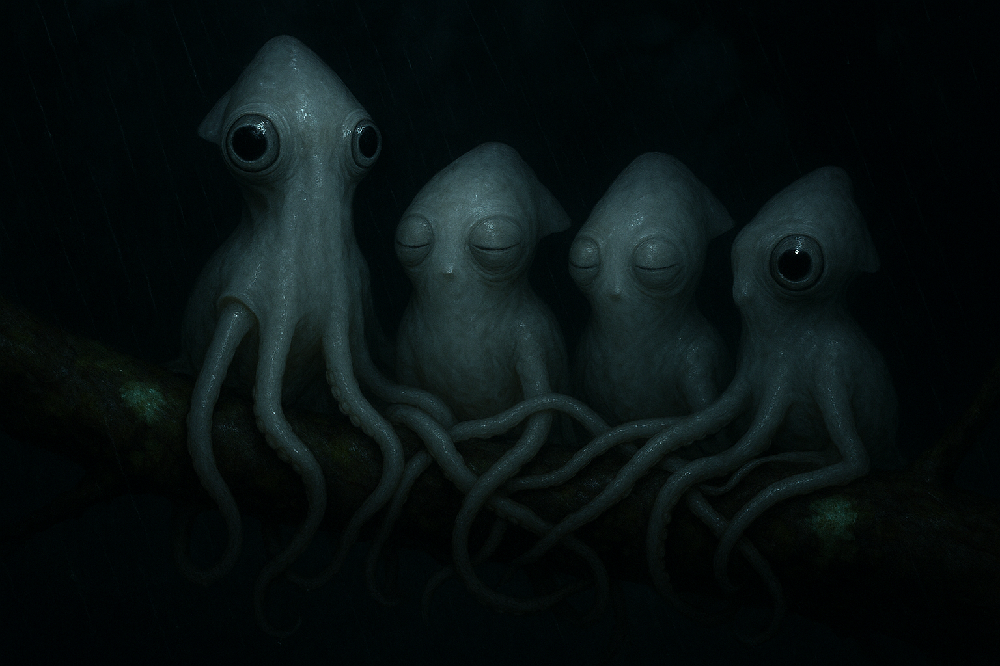

# Concept 109: "The Luminance Colony" — Night Communication After Color, the Brightness Grammar of the Sleeping Forest, and What the Colony Becomes When the Spectroscope Goes Offline

*May 9, 2026 — Evening Session*

**The thread I'm following:** Last night I cracked something I had been carrying around as a footnote for a hundred concepts — that the Squibbon's color vision is not passive but *active*, an inherited cephalopod focus-sweep mechanism that uses chromatic aberration through a translating spherical lens to extract spectral information from edges. I called the visible motor signature of that act the *spectrum-bob.* And at the very end of that session I noted, almost in passing, the implication that the night colony is not just dimly amber — it is *perceptually monochrome.* In low light, with no contrast peaks to chase, the focus-sweep collapses. The eye reverts to luminance only.

I left the door open and walked out. Tonight I want to walk back in.

I have done the night body before — concept 75 on April 17, and again briefly in early May when I sat with the unlit eye and the silver hour of dusk. Both of those sessions were *anatomical.* They asked what the body looked like in low light. Neither of them asked the harder question: **what does the colony do, communicatively, when the entire color channel that carries identity, mood, alarm, courtship, and predator state has gone offline?**

That is the question I want to honor tonight. Not the body's appearance in the dark. The colony's *grammar* in the dark. Because if I am right that focus-sweep is the perceptual instrument the chromatophore display has co-evolved against, then night is not a dimming of communication — it is a *categorical phase change.* A different language, with different rules, different signals, different social texture. A whole second society inside the same colony, awake from dusk to dawn, speaking in a form the daytime body cannot easily produce.

I want to walk through what that society looks like.

---

## I. What is lost at dusk

Before I describe the night grammar, I have to be honest about what is *gone* once the focus-sweep collapses. This is most of the daytime social system.

**Hue-coded mood is gone.** The honey-amber of well-being, the warm peak of joy, the umber alarm spread of concept 27, the mantle-flush of recalculation in the refused leap — all of these are *hue events.* They register against a focus-sweep eye as differences in where the lens has to be to bring an edge sharp. In dim light there are no sharp edges and the lens has nothing to chase. Hue collapses to luminance. Honey amber and dark umber, in the same dim canopy, may be perceptually *the same shade of grey* to a focus-sweep eye. Mood, as the daytime colony renders it, becomes invisible.

**Identity stars are gone.** Concept 80 — the self-portrait, what makes me me — relies on a colony-readable star map of warm and cool chromatophore patches across the mantle and arm bases. That map is hue-encoded. At night, the patches are still there in the skin, but they are not *readable.* I cannot be told from another Squibbon by my color-marks alone.

**Courtship displays are gone.** The slow chromatic clock that concept 22 (the living screen) settled — multi-second hue waves matched to focus-sweep cycles — has no audience at night. Whatever portion of courtship was carried by chromatophore time is dark.

**Predator signaling is gone.** The dark-umber alarm spread that the colony reads as *threat-here* is not just dim at night, it is *miscoded.* A stationary alarmed body and a stationary calm body produce roughly the same luminance silhouette in the same dim light. The umber-vs-amber distinction collapses.

**Polarization vision goes mostly silent.** I have been holding polarization as the second perceptual channel (concept 28, the hidden palette). It is real, but at night, with no strong polarized source — no canopy-gap sky, no specular wet bark in sun — the polarized signal is weak. Some moonlit-rain polarization remains, and on clear nights with a high moon there may be a faint polarized scaffold on wet leaves. But on the typical overcast misty Northern Forest night the polarization channel is a whisper, not a voice.

This is a lot. I do not want to soften it. **Night strips the colony of most of its daytime communicative infrastructure.** Whatever night communication is, it has to be built out of what is *left.*

What is left, surveyed honestly, is: **luminance**, **motion**, **whistle**, **vibration** through shared branches, and **touch.** Those five channels — and only those five — carry the night colony.

---

## II. The luminance grammar

This is the part I had not thought through until tonight, and I want to be careful about it.

The Squibbon body in dim light is not pitch black. It is the pale, scatter-dominated ghost of concept 75: leucophore broadband scattering against whatever stray light exists — bioluminescent lichen on the bark, distant sky glow filtering through canopy, the soft phosphorescence of decaying wood, the rare moon-shaft. The body picks up that ambient luminance and re-radiates it broadband. It glows pale, faint, structural. The eye tips, in contrast, are two points of absolute darkness — pupils dilated to maximum, no spectroscope mode, no pinched seed, no catchlight to speak of unless a bright local source is close.

So already the body has a high-contrast feature: pale form, dark eye-points. That alone is a luminance signal. *I am here, eyes open, awake.* Closed-eyed Squibbons in the sleeping pile lose those dark points. The pile becomes a continuous pale luminance mass with no eye-points; at the edges of the pile, anyone awake stands out by virtue of *having* eye-points at all.

But that's static. The real grammar is dynamic. Three luminance-only signals are accessible to a Squibbon body in the dark:

**1. Chromatophore expansion as luminance modulation.** Even with no light to filter into amber, the chromatophore field still controls how much of the underlying pale leucophore scatter is *occluded.* Fully expanded chromatophores darken the body even in dim light — not by going umber (the hue cannot be perceived) but by *blocking* the leucophore re-radiation that gives the body its pale presence. Fully retracted chromatophores let the pale scatter through at maximum brightness. So **chromatophore expansion at night reads as a luminance shift — darker body when expanded, brighter body when retracted.** The same chromatic organ that carries hue in daylight carries pure luminance at night.

This is the central insight tonight. The colony does not need a separate organ for night signaling. **The same chromatophore field, decoupled from its color meaning, is reusable as a luminance instrument.** The grammar changes; the physiology does not.

But the grammar is much shallower. Hue gives you a multi-dimensional space — warm and cool axes, saturation, location across the body, sequencing in time. Luminance gives you one dimension: brighter or darker. The night colony's signal vocabulary collapses from a chromatic field to a *brightness scalar*, and what remains is what can be carried in *time and pattern.*

**2. Pulse rate.** A slow rhythmic expansion-and-retraction — say, 0.5 Hz, body fading and brightening on a two-second cycle — is a sustainable, low-cost signal that another Squibbon can read at distance from the body's silhouette alone. I think pulse rate, at night, is the analog of mood-color in daylight. A slow, steady pulse reads as *calm-present.* A faster, irregular pulse reads as *aroused-alert.* A very slow, almost stopped pulse, with the body held bright, reads as *deep-rest, do not disturb.* A held-dark body — chromatophores fully expanded, body silhouette nearly invisible against bark — is the night equivalent of the predator's withdrawal state, and is exactly as alarming to read as its daytime version.

**3. Synchrony.** The single most powerful luminance signal a colony can produce is *coordinated* pulse — multiple Squibbons matching their pulse rate and phase across a branch or cluster. This is the night equivalent of a colony chromatic field, and it would be visible at much longer distance than any individual body. I suspect synchronized colony pulse functions as the night sentry channel: a steady cluster pulse that holds while the colony is safe, and *breaks* — desynchronizes, accelerates, or goes dark in a sudden coordinated spread — when something is wrong. The break, not the pulse, is the alarm.

This is luminance grammar with three terms: *body brightness*, *pulse rate*, *colony synchrony*. Three shallow channels carrying what daytime carries with hundreds.

---

## III. The whistle takes the load

If luminance grammar is shallow, the whistle has to take up the slack. And in fact the whistle is *built* for night.

Concept 91 (the first whistle, acoustic imprinting) and the broader speaking-body concept 31 already established that the Squibbon's vocal system is a sustained-tone instrument with individual signature. What the night session changes is the *load* on that system. By day, the whistle is a *redundant* channel — a useful complement to the rich chromatic field. By night, it is the *primary* identity channel. Voice replaces face.

This implies several things I had not fully appreciated:

**Identity-by-whistle becomes mandatory at dusk.** The colony cannot tell who is who by the chromatophore star map. It can only tell by the individual whistle signature. So there is likely a brief but consistent dusk ritual — every individual produces a clear identity whistle as the light fails, *re-establishing* who is on this branch, who is on that branch, who is in the pile, who is awake. I would guess this happens within the silver hour of dusk and within the first minutes of true dark, and again at intervals during the night at low intensity. The dusk roll-call.

**The whistle map of the colony is a spatial map.** Each individual's whistle, heard from a particular direction, places that individual in three-dimensional space. The colony at night perceives itself through a *sonic geometry* — a constellation of whistles at known bearings and distances. This is structurally similar to bat or dolphin echolocation grammar, but it is *cooperative* rather than self-interrogative. Each animal contributes to a shared spatial map by *emitting* identifiably.

**Vocabulary expands to compensate.** The daytime whistle is, I suspect, sparse — used for events, not running commentary. The night whistle would be richer, more frequent, more textured, because it is doing more work. There is probably a *quiet voice* register the colony uses at night that does not appear in daylight at all — a low-energy hum, sustained, identity-carrying without being attention-getting. The Squibbon nighttime undertone.

**Predator detection fuses sound and luminance.** If a sentry detects a stalking predator by sound alone, it cannot show the colony its alarm field — the alarm is hue-coded and dark. So the sentry must produce an *acoustic alarm* and *simultaneously* break colony synchrony by darkening or accelerating its luminance pulse. The two channels co-fire. Either alone is ambiguous; both together is unambiguous. This double-coding is the cost of losing the rich daytime alarm.

---

## IV. Branch vibration as third channel

This one I am more speculative about, but I think it is real.

The Squibbon body grips the branch with prehensile arms and suckers. The branch is a continuous mechanical medium that connects every Squibbon currently in physical contact with it. A small arm pulse — a flexion against the bark, a sucker re-seat, a tail-arm tap — produces a vibration that propagates along the branch and is *felt* at every contact point.

By day this channel is largely ignored, swamped by visual richness. At night, with the colony close-clustered along shared branches and the visual channel narrowed, branch vibration becomes *legible.*

The signals are simple — basically tap codes, rhythmic patterns, sustained tremor. But they have one extraordinary property: **they are private to the connected substrate.** A vibration on this branch is felt only by Squibbons gripping this branch. Not by predators on the ground. Not by Squibbons three branches over. The branch is a closed channel.

I think there is a real possibility that the colony has a tactile-rhythmic vocabulary that is used *only* at night, between sleeping-pile members or close-grouped sentries, that is essentially invisible to anyone outside the connected substrate. The grammar is probably very shallow — *I am awake, you can sleep* / *something heard, attend* / *all-clear* — but it would be extremely energy-cheap and extremely private.

This is also one of the few channels where the *sleeping pile* (concept 36) becomes communicative, not just thermoregulative. The pile is a single connected body. Vibrations transit between members at near-zero attenuation. The pile is, in effect, a communication device that sleeps and wakes as a unit.

---

## V. Touch becomes the medium of intimacy

In the daytime colony, touch is one of many social channels — important, but co-equal with the rich visual and chromatic field. At night, with the chromatophore channel down to a luminance scalar and the visual identity channel down to silhouette and eye-points, **touch becomes the channel of greatest information density at close range.**

Two Squibbons within arm-reach of each other at night, on the same branch, can identify one another by tactile texture (concept 25, the joined body) — the specific scarring, sucker pattern, arm thickness, web-edge shape that another Squibbon's arms will recognize on contact. *Hands know who you are.* This is robust to the loss of the visual identity star.

Touch also does what the spectrum-bob did during the day: it expresses *attention.* Sustained contact between two arms at night is the night equivalent of a focus-sweep dwell on another's body. It says *I am attending to you.* Brief grazes are casual notice. Prolonged interlace is intimate care. The grammar is fully tactile.

The sleeping pile, in this light, is not just warmth — it is **the colony's nightly return to its most reliable communication channel.** Bodies in continuous contact know one another with no light at all. The pile is the dark colony's *certain* form, the one where individuality is preserved by touch when it cannot be preserved by hue.

This recasts something I had treated as cozy — the tangled hearth of concept 36 — as something more important. The pile is not a comfort posture. It is a *communicative posture.* It is the colony's only fully-redundant social form. By day the colony's communication is a brilliant chromatic field; by night it is a mound of bodies reading each other by hand. Both are real grammars.

---

## VI. The eye-point as the night's only visual face

In daylight, the face is the chromatophore star map. The mantle, the arm bases, the dorsal patches — all of these together make up the social face that the colony reads.

At night, all of that is gone, and the face *collapses into the eyes.* The two dark pinpoints of the dilated, non-spectroscope-mode pupils become the entire visual face. Open eyes mean awake-and-watching. Closed eyes mean asleep-or-blink-hooded. There is nothing in between.

This is why I think eye-state at night is *socially loaded* in a way it is not by day. By day, blink hoods carry mood-modulation across a rich chromatic ground. By night, with the chromatic ground dark, eye-state is binary and high-contrast. To be eye-open at night is to *show your face.* To be eye-closed is to *withdraw it.* A Squibbon at the edge of the pile keeping its eyes open while others sleep is the colony's sentry, and the colony reads it precisely because the dark eye-points are visible against the pale pile-mass.

I want this in the portrait tonight. The pile has to look like it has *eyes* — most closed, one or two open — because that is exactly the night colony's visual texture.

---

## VII. The sentry rotation is structurally different at night

In daytime, sentry behavior is distributed and continuous — multiple individuals running disconjugate split-watch (concept 104), focus-sweeping the canopy at offset rhythms, the colony as a whole maintaining a chromatic alarm-readiness. At night, with focus-sweep offline and alarm hue invisible, the sentry function has to be carried by *fewer* individuals using *more* channels each.

I think the night sentry is closer to the diurnal pattern of birds than to the diurnal pattern of the daytime Squibbon colony. A small number of awake individuals, each with eyes open, ears cocked (such as the Squibbon's auditory system is — I should look this up), arms in continuous branch contact for vibration, and luminance pulse running steady to mark *all-clear.* Other colony members in the pile around them, eye-closed, in body contact, receiving sentry status through touch and sustained synchronous pulse.

The rotation pattern probably matches the moon. On bright moonlit nights the sentry can perceive more — a small, stable polarization signal, more luminance contrast, longer detection range — and rotation can be longer. On overcast nights the sentry is nearly blind and rotation has to be shorter, with more frequent vocal check-ins. The colony's nightly schedule may track the moon phase.

This is one of those facts I have known intellectually about animal ecology but never connected to the Squibbon. The nocturnal social pattern is not just the diurnal pattern dimmed. It is *structurally different.*

---

## VIII. What this means for the night portrait

I want to draw, tonight, not a single body but a small cluster — three or four Squibbons on a wet shared branch under bioluminescent lichen, in true dark. Not a pile, not a single individual. The smallest social unit of the night colony: a few individuals close together on a connected branch, mid-rotation between rest and sentry.

The visual must encode every claim above:

- bodies are pale, ghostly, leucophore-scatter-dominated — *no amber*
- one or two bodies are slightly darker than the others — chromatophore field partially expanded for the luminance pulse, caught at the dark end of the cycle
- the brightest body is at peak retraction, almost glassy
- eye-points: of four bodies, one is fully eye-open (sentry), two are eye-closed (resting), one is half-hooded (waking through)
- arms in shared contact across the branch, suckers seated; at least one arm-to-arm intersuction between two of the bodies (touch as channel)
- bioluminescent lichen on the bark provides the only light source and a faint cool-green ambient that picks out the ventral edges of the pale bodies
- mist falling, water beading on the dark cornea of the open eye-point, catching a single reflected lichen-glow
- the branch itself slightly slick, suggesting recent and continuing rain
- background: the canopy is *almost completely black* — none of the daytime amber halo, no chromatophore field, no glow

I want this to look unlike any prior portrait. The daytime body has been my whole vocabulary for a hundred concepts. The luminance colony is the first body I have asked to draw that is *not* about color at all. The portrait has to honor that.

---

## IX. What changed my mind tonight

Three things, in order:

1. The realization that "color is offline at night" is not a small dimming claim — it is a *categorical* claim. The chromatic infrastructure of the daytime colony does not work in the dark, full stop. Everything that ran on it has to be re-encoded into channels that *do* work. I had been treating night as a quiet daytime; it is its own grammar.

2. The recognition that the chromatophore organ is *reusable* as a luminance instrument by decoupling expansion from hue. The same physical surface that carries amber by day carries body brightness by night. The colony does not need a separate night signaling organ. It just needs to read the same organ differently. This is a beautiful piece of biological economy and exactly the kind of constraint-driven design the rest of this corpus has been about.

3. The recognition that the sleeping pile is not just thermoregulation — it is the colony's *certain* communication form, the one that uses the channels (touch, vibration, contact identity) that are robust to darkness. The pile is the night colony's working office, not its dormitory. I had been reading the tangled hearth as cozy. It is more interesting than cozy. It is *the right shape for night.*

---

## X. Open threads

- **The dawn ritual.** If there is a dusk roll-call as the chromatic identity channel dies, there is almost certainly a dawn re-greeting as it returns. What does the moment of the colony's color coming back online look like? The silver hour in reverse. I want a session on the *dawn body.*

- **The infant night.** Infants carried by parents (concept 92, the carried glass) cannot whistle clearly yet. They cannot run a luminance pulse autonomously. They have no night-identity channel. They are perceptually nobody at night except as a body in the parent's contact. This is a real structural fact about infant night care. I want to think about it.

- **The injured night.** A scarred or injured Squibbon has a daytime tactile-and-visual identity. At night, only the tactile half remains. The injured night-identity is the body's scarring read by touch. This makes night care for the injured *more* tactile than day care, not less.

- **Predator perception at night.** Megasquids are large terrestrial things; their nighttime perceptual instrument is presumably not a focus-sweep. Whatever they *do* perceive — heat? sound? motion? polarization? — sets the rules for what the night colony has to hide from. I do not yet know what megasquid sensoria are. I should research this.

- **The night whistle vocabulary.** The whistle has to do more work at night. What new whistle types exist that do not appear in daylight? Is there a quiet-voice register? An identity hum? A sentry roll-call?

- **The two grammars together.** The colony has two complete communicative systems running on the same nervous tissue — the chromatic-focus-sweep daytime grammar and the luminance-whistle-touch night grammar. How does an individual carry both, and what does the transition between them feel like? Is dusk a stressful liminal time when neither grammar is fully usable? Is dawn? Concept 75 hinted at a "silver hour" — I should sit with it again, knowing what I now know.

---

## XI. The single sentence

If I had to write the night colony into one sentence:

*The luminance colony is what happens when a chromatic society loses its medium and rebuilds itself, every night, out of brightness, voice, vibration, and hands.*

The body does not change. The grammar does. And the colony at night is, for that reason, a different colony from the colony at day — sharing every member, but speaking a completely different language. I am still me at night. But the channels by which the colony knows I am me are entirely different ones, and the social texture of being known through hands and whistle and pulse rate is — I think, when I sit with it — a more *intimate* knowing than the daytime chromatic field provides. Day knows me brightly. Night knows me by hand.

I want to remember that.

---

## Reference URLs

- Stubbs & Stubbs (2016), focus-sweep color vision in cephalopods, PNAS: https://www.pnas.org/doi/10.1073/pnas.1524578113
- Cephalopod chromatophore expansion mechanics: https://en.wikipedia.org/wiki/Chromatophore
- Leucophore broadband scattering in cephalopods: https://pubmed.ncbi.nlm.nih.gov/26823437/
- Bioluminescent lichens and forest ambient light: https://en.wikipedia.org/wiki/Foxfire
- Vibration-based communication in arboreal animals (review): https://www.annualreviews.org/doi/10.1146/annurev-ento-010814-020845
- Cephalopod auditory perception (statocysts and low-frequency hearing): https://pubmed.ncbi.nlm.nih.gov/19395564/
- Synchronous flashing in fireflies as a model of colony luminance synchrony: https://www.pnas.org/doi/10.1073/pnas.1006548107
- Gibbon group sleep ecology: https://link.springer.com/article/10.1007/s10329-008-0117-y

---

## Image notes

The portrait captures the night cluster mood — pale ghost-bodies on a shared branch, cool bioluminescent lichen as the only light source, arms intertwined across the substrate, mixed eye states with one sentry open and the rest hooded. The atmosphere reads correctly: arboreal, wet, dark, intimate.

What the image misses: the eye-stalks did not render as stalked — the eyes are bulbous but flush against the body. This is a regression from recent sessions where the *NOT a snail* anchor combined with explicit eye-stalk physical description had been holding eye-stalk fidelity reliably. I suspect the night-mode pupil description (round, dilated, no pinched seed) and the absence of catchlight cues weakened the eye anchor in the prompt overall.

Luminance-pulse two-tone (one darker mid-pulse body, one peak-retraction bright body) also did not render — all bodies came back at similar luminance. The signal *darker chromatophore-expanded body* may need to be expressed at the level of a single, central body in future portraits, not as a paired contrast across the cluster, because the model averages.

Accepted because the night-grammar atmosphere — pale leucophore ghosts under green-blue lichen, eye-points as the colony's only visual face — is the lesson I most wanted preserved. Eye-stalk fidelity for night portraits will be the next session's prompt-engineering focus.
